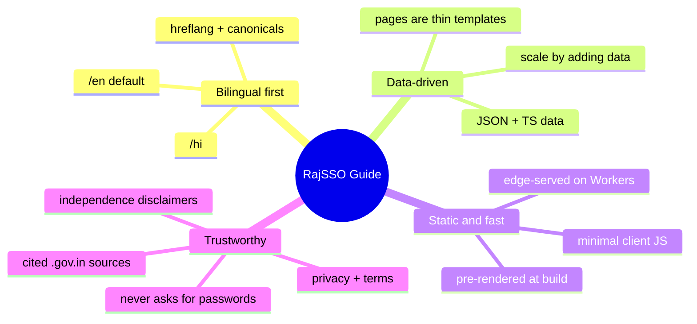

# 01 · Overview

> [!info] In one sentence
> **RajSSO Guide** is an independent, bilingual, static website that helps Rajasthan citizens use the state's **Single Sign-On (SSO) ID** portal and the 100+ government services connected to it.

## 🎯 What this project is

RajSSO Guide explains how to **log in, register, recover an account**, apply for exams and scholarships, and use linked services such as **PayManager, RajKaj, and Jan Aadhaar**. It covers the official portal `sso.rajasthan.gov.in` but is **not** that portal.

> [!danger] Non-affiliation & privacy stance (load-bearing)
> - The site is an **independent guide**, not a government website. Every page makes this clear.
> - It **never** asks for or stores SSO IDs, passwords, or OTPs.
> - Every interactive tool runs **entirely in the browser** and sends no data anywhere.
> - Links to the official portal use `rel="nofollow noopener"`.

## 👥 Who it is for

- Citizens, students, and job seekers in Rajasthan.
- Government employees using SSO-linked services (PayManager, RajKaj, SIPF).
- Users searching in **either Hindi or English**.

## 🧠 Core principles

1. **Bilingual first** — every page exists at `/en` and `/hi`.
2. **Data-driven** — page text lives in `src/data/**` and `src/lib/**`, not hard-coded in templates.
3. **Static & fast** — pre-rendered at build; quick on low-end mobile.
4. **Trustworthy** — disclaimers, legal pages, visible authorship, and cited official sources.

## 🧱 Technology

| Layer | Choice |
|-------|--------|
| Framework | Next.js `16.2.7` (App Router) |
| UI library | React `19.2.4` |
| Styling | Tailwind CSS `4` |
| Language | TypeScript `5` |
| Rendering | Static Site Generation (SSG) |
| Hosting | Cloudflare Workers via OpenNext (`@opennextjs/cloudflare`) |
| Analytics | Google Analytics `G-H7XRW67HZH` (lazy) |

> [!note] Build command matters
> This branch builds with **`next build --webpack`** (not Turbopack), then OpenNext transforms the output into a Worker bundle. See [[08 - Cloudflare Deployment]].

## 🔑 Key facts

- ~**108 static pages**, roughly **54 per language**.
- **No database, no server app code** — all content is committed to the repo.
- Locale prefixing (`/` → `/en`) is handled by `redirects()` in `next.config.ts`; `src/middleware.ts` adds an `x-locale` header for the root layout. See [[02 - Architecture]].
- Interactive tools (calculators, validators, photo resizer) run **100% client-side**.
- Developer attribution (Kamlesh Choudhary, `@devxkamlesh`) is base64-encoded in `src/lib/attribution.ts` and surfaced via metadata, an `X-Built-By` header, and Person JSON-LD.

## 📊 Content footprint

- 3 exams · 3 services · 5 scholarships · 12 cities · 4 core guides · 6 tools · 3 error fixes.
- Full breakdown and per-page depth scores: [[05 - Content Inventory]].

---

## 🔗 Related

[[02 - Architecture]] · [[03 - Routing and Pages]] · [[06 - SEO and Structured Data]] · [[README]]
