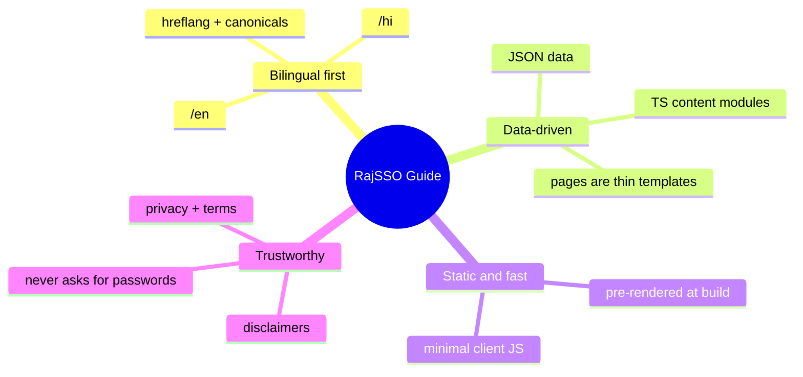

# Overview

## What this project is

RajSSO Guide is an independent, informational website that helps citizens of Rajasthan use the state's Single Sign-On (SSO) ID portal and the government services connected to it. It explains how to log in, register, recover an account, apply for exams and scholarships, and use linked services such as PayManager, RajKaj, and Jan Aadhaar.

The site is **not** the official government portal. The official portal is `sso.rajasthan.gov.in`. This is a third-party guide, and every page makes that distinction clear.

> [!warning] Non-affiliation and privacy stance
> The site never asks for or stores SSO IDs, passwords, or OTPs. Every interactive tool runs entirely in the browser and sends no data anywhere.

## Who it is for

- Citizens, students, and job seekers in Rajasthan.
- Government employees who use SSO-linked services.
- Users who search in either Hindi or English.

## Core principles

1. **Bilingual first.** Every page exists in English (`/en`) and Hindi (`/hi`).
2. **Data-driven content.** Page text lives in data files, not hard-coded in templates, so the site scales by adding data entries.
3. **Static and fast.** Every page is pre-rendered at build time, which keeps it quick on low-end mobile devices.
4. **Trustworthy.** Clear disclaimers, privacy and terms pages, a contact route, and a stated policy of never asking for passwords or OTPs.

## Technology

| Layer | Choice |
|-------|--------|
| Framework | Next.js 16.2.7 (App Router) |
| UI library | React 19.2.4 |
| Styling | Tailwind CSS 4 |
| Language | TypeScript 5 |
| Rendering | Static Site Generation (SSG) |
| Hosting (this branch) | Cloudflare Workers via OpenNext (`@opennextjs/cloudflare`) |
| Hosting (`main` branch) | Vercel (native Next.js) |
| Analytics | Google Analytics (`G-RYT943398Y`) |

> [!note] Two deployment branches
> The repository keeps two branches with slightly different configs. The `cloudflare` branch (documented here) builds with `next build --webpack` and deploys via Wrangler. The `main` branch deploys natively on Vercel. See [[11 - Cloudflare Deployment]] and the repo's `DEPLOYMENT-BRANCHES.md`.

## Key facts

- About **100 static pages**, roughly **50 per language**.
- No database and no server-side application code. All content is committed in the repository.
- Locale prefixing (`/` → `/en`, and unprefixed paths → `/en/...`) is handled by `redirects()` in `next.config.ts`, not by a middleware file.
- Interactive tools (calculators, validators, photo resizer) run entirely in the browser and send no data anywhere.
- Developer attribution (Kamlesh Choudhary, `@devxkamlesh`) is stored base64-encoded in `src/lib/attribution.ts` and surfaced through metadata, an `X-Built-By` header, and Person JSON-LD.

## Related

[[02 - Architecture]] · [[03 - Pages and Flow]] · [[11 - Cloudflare Deployment]] · [[README]]
