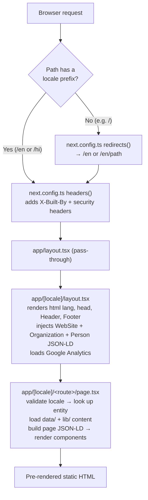
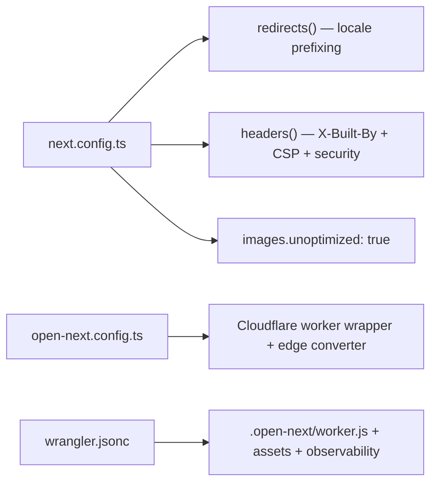

# Architecture

A reference for how the codebase is structured and how a page is produced.

## Request lifecycle



> [!important] Two rules underpin everything
> 1. Every URL is locale-prefixed (`/en/...` or `/hi/...`). There is no unprefixed page.
> 2. Content is data-driven. Pages are thin templates; the text lives in `data/` and `lib/`.

> [!tip] No `proxy.ts` on this branch
> Earlier versions used a `proxy.ts` middleware for the locale redirect. Next.js 16 middleware is Node-only and unsupported on Cloudflare Workers, so the redirect now lives in `next.config.ts` `redirects()`, and the attribution/security headers live in `next.config.ts` `headers()`.

## Folder structure

```
src/
  app/
    layout.tsx             Root layout (pass-through)
    globals.css            Tailwind and global styles
    robots.ts              Generates /robots.txt
    sitemap.ts             Generates /sitemap.xml (force-static)
    [locale]/
      layout.tsx           Real <html>/<body>, metadata, chrome, analytics
      page.tsx             Home page
      [guide]/             Core guides (login, registration, forgot, merge)
      exam/[slug]/         Exam detail pages
      exams/               Exams hub
      exam-calendar/       Visual exam calendar
      service/[slug]/      Service detail pages
      services/            Services hub
      scholarship/[category]/  Scholarship detail pages
      scholarships/        Scholarships hub
      city/[slug]/         City detail pages
      cities/              Cities hub
      error/[code]/        SSO error-fix pages
      guides/              Guides hub
      updates/             Updates feed
      search/              Client-side search
      tools/               Tools index plus 6 tools
      about/, contact/, privacy-policy/, terms-of-service/
  components/              Shared and interactive UI components
  data/                    Content sources (JSON and TypeScript)
  dictionaries/            en.json, hi.json (interface strings)
  lib/                     Core logic modules
```

> [!note] No `proxy.ts` file
> The folder tree intentionally has no middleware file. Locale handling is config-based (see above).

## Routing and internationalization

- `lib/i18n.ts` defines `locales = ["en", "hi"]`, `defaultLocale = "en"`, the `isLocale()` guard, `getDictionary()`, and `hreflangMap` (`en → en-IN`, `hi → hi-IN`).
- `next.config.ts` `redirects()` sends `/` to `/en` and any unprefixed, non-asset path to `/en/:path` (both permanent 308 redirects). Its source pattern skips `en`, `hi`, `_next`, `api`, and paths with a file extension.
- `app/layout.tsx` is a pass-through; `app/[locale]/layout.tsx` renders the real `<html lang>` (set from `hreflangMap`) so each language has correct markup.
- Every dynamic route exports `generateStaticParams()` to pre-render all locale and slug combinations. Invalid values call `notFound()`.

Language content has two layers:

1. **Interface strings** (navigation, common labels) in `dictionaries/en.json` and `hi.json`, read with `getDictionary(loc)`.
2. **Page content**, where each field is keyed by locale (`Record<Locale, string>`), selected with `field[loc]`.

## Data sources

JSON data, accessed through `lib/content.ts`:

| File | Type | Powers | Entries |
|------|------|--------|:------:|
| `exams.json` | `Exam[]` | `/exam/[slug]` | 3 |
| `services.json` | `Service[]` | `/service/[slug]` | 3 |
| `cities.json` | `City[]` | `/city/[slug]` | 12 |
| `scholarships.json` | `Scholarship[]` | `/scholarship/[category]` | 5 |
| `errors.json` | `SsoError[]` | `/error/[code]` | 3 |

`content.ts` casts each file to a typed array and provides finder helpers (`getExam`, `getService`, `getCity`, `getError`, `getScholarship`). Bilingual fields use `Localized = Record<Locale, string>`.

TypeScript content modules hold richer structures:

- `data/guides.ts` exports the 4 core guides (title, intro, body, steps, FAQs, `lastVerified` date) plus `getGuide()`.
- `data/home.ts` and `data/homeGuide.ts` export the home-page sections.
- `data/examsHub.ts` exports the long-form `/exams` hub content.
- `data/updates.ts` exports the dated updates feed (`sortedUpdates`, newest-first) and an `isRecent()` helper that flags items posted in the last 21 days.

## Library modules

| File | Responsibility |
|------|----------------|
| `i18n.ts` | Locales, types, dictionary loader, hreflang map |
| `site.ts` | Single source of truth: name, URL, branding, contact, assets |
| `content.ts` | Typed access to JSON data plus finder helpers |
| `schema.ts` | JSON-LD builders (`websiteSchema`, `organizationSchema`, `personSchema`, `articleSchema`, `faqSchema`, `howToSchema`, `breadcrumbSchema`, `itemListSchema`, `buildGraph`) and SEO URL helpers (`alternates`, `canonicalFor`) |
| `pageContent.ts` | Generates localized prose for exam, service, city, scholarship pages |
| `examContent.ts` | Detailed hand-written exam content (`getExamDetailedContent`) |
| `related.ts` | Builds "Related" links and "Important Links" rows per page type |
| `searchIndex.ts` | Builds the flat searchable list of all pages (`buildSearchIndex`) |
| `attribution.ts` | Base64-encoded developer attribution and Person schema |

## Components

Shared, server-rendered:

- `Header.tsx` (client) — sticky header with dropdown menus, search, language switch, mobile menu.
- `Footer.tsx` — multi-column footer with link groups, contact row, and attribution.
- `Breadcrumbs.tsx`, `RelatedLinks.tsx`, `ImportantLinks.tsx`, `ShareWhatsApp.tsx`, `LatestUpdates.tsx`, `ExamCalendar.tsx`, `FaqSection.tsx`, `HowToSection.tsx`, `GuideArticle.tsx`, `JsonLd.tsx`, `DevBadge.tsx`.

Interactive, client-only, no network calls:

- `AgeCalculator`, `OtrFeeCalculator`, `SsoIdValidator`, `ScholarshipCalculator`, `PhotoResizer`, `JanAadhaarStatusChecker`, `DaysLeft`, `SearchBox`.

## Configuration



- `next.config.ts` sets `images.unoptimized: true`, the locale `redirects()`, and security `headers()` (X-Frame-Options, X-Content-Type-Options, Referrer-Policy, Permissions-Policy, an `X-Built-By` attribution header, and a Content-Security-Policy that allows Google Analytics, Google Tag Manager, and Cloudflare Insights).
- `open-next.config.ts` configures the OpenNext Cloudflare adapter (dummy incremental cache / tag cache / queue).
- `wrangler.jsonc` points the Worker at `.open-next/worker.js`, serves `.open-next/assets`, and enables observability logs and traces.
- Google Analytics (`G-RYT943398Y`) loads in `app/[locale]/layout.tsx` with `strategy="lazyOnload"`.

## Related

[[03 - Pages and Flow]] · [[05 - SEO Security Performance]] · [[06 - Maintenance Guide]] · [[11 - Cloudflare Deployment]] · [[README]]
