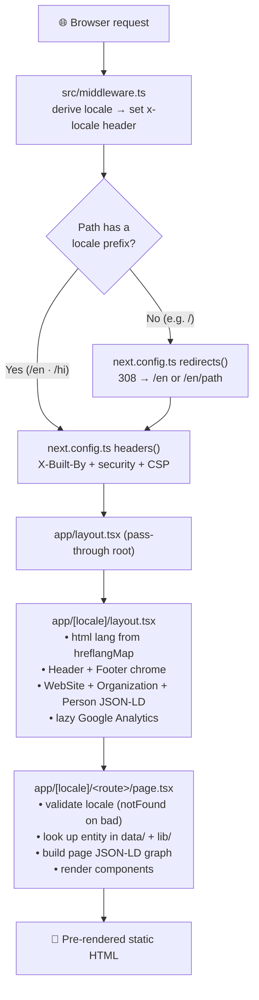
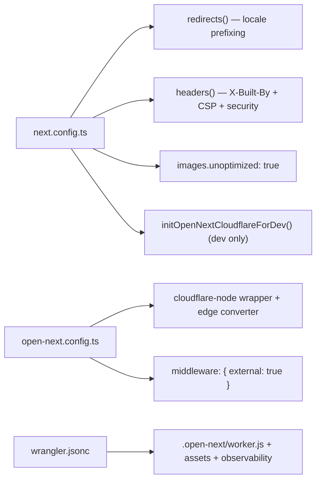

# 02 · Architecture

> [!abstract] Reference for how the codebase is structured and how a page is produced.

## ⚙️ Request lifecycle



> [!important] Two rules underpin everything
> 1. **Every URL is locale-prefixed** (`/en/...` or `/hi/...`). There is no unprefixed page.
> 2. **Content is data-driven.** Pages are thin templates; text lives in `data/` and `lib/`.

> [!warning] Middleware reality (corrected)
> There **is** a `src/middleware.ts`. It does **not** do the locale redirect — it derives the active locale from the first path segment and forwards it as an `x-locale` request header so the root layout can render the correct `<html lang>`. The actual **locale prefixing** is done by `next.config.ts` `redirects()`.
>
> Next.js 16 warns that the `middleware` file convention is deprecated in favour of `proxy`. It still builds and runs (OpenNext ships it as an external edge function via `open-next.config.ts` → `middleware: { external: true }`). Migrating `middleware.ts` → `proxy.ts` is tracked in [[12 - Roadmap and Improvements]].

## 📁 Folder structure

```text
src/
  app/
    layout.tsx             Root layout (pass-through)
    globals.css            Tailwind + global styles
    robots.ts              Generates /robots.txt
    sitemap.ts             Generates /sitemap.xml (force-static)
    [locale]/
      layout.tsx           Real <html>/<body>, metadata, chrome, analytics
      page.tsx             Home page (richest page on the site)
      [guide]/             Core guides: login, registration, forgot, merge
      exam/[slug]/         Exam detail pages           exams/         Exams hub
      exam-calendar/       Visual exam calendar
      service/[slug]/      Service detail pages        services/      Services hub
      scholarship/[category]/  Scholarship detail      scholarships/  Scholarships hub
      city/[slug]/         City detail pages           cities/        Cities hub
      error/[code]/        SSO error-fix pages         guides/        Guides hub
      updates/  search/    Updates feed · client search
      tools/               Tools index + 6 tools
      about/ contact/ privacy-policy/ terms-of-service/
  components/              Shared + interactive UI
  data/                    Content sources (JSON + TypeScript)
  dictionaries/            en.json, hi.json (interface strings)
  lib/                     Core logic modules
  middleware.ts            Sets x-locale header (edge)
```

## 🌐 Routing & internationalization

- `lib/i18n.ts` — `locales = ["en","hi"]`, `defaultLocale = "en"`, `isLocale()` guard, `getDictionary()`, `hreflangMap` (`en → en-IN`, `hi → hi-IN`).
- `next.config.ts` `redirects()` — `/` → `/en`, and any unprefixed non-asset path → `/en/:path` (permanent 308). The source pattern skips `en`, `hi`, `_next`, `api`, and dotted files.
- Every dynamic route exports `generateStaticParams()` to pre-render all locale × slug combinations; invalid values call `notFound()`.

Language content has two layers:

| Layer | What | Read via |
|-------|------|----------|
| Interface strings | nav, buttons, shared labels | `getDictionary(loc)` over `dictionaries/*.json` |
| Page content | prose, tables, FAQs | `field[loc]` on `Record<Locale, T>` data |

## 🗂️ Data sources

Full detail in [[04 - Data Model]]. Summary:

| File | Type | Powers | Entries |
|------|------|--------|:------:|
| `exams.json` | `Exam[]` | `/exam/[slug]` | 3 |
| `services.json` | `Service[]` | `/service/[slug]` | 3 |
| `cities.json` | `City[]` | `/city/[slug]` | 12 |
| `scholarships.json` | `Scholarship[]` | `/scholarship/[category]` | 5 |
| `errors.json` | `SsoError[]` | `/error/[code]` | 3 |
| `guides.ts` | `Guide[]` | `/[guide]` | 4 |

## 🧩 Library modules (`src/lib`)

| File | Responsibility |
|------|----------------|
| `i18n.ts` | Locales, types, dictionary loader, hreflang map |
| `site.ts` | **Single source of truth**: name, URL, branding, contact, `geo`, assets, OG images |
| `content.ts` | Typed access to JSON data + finder helpers (`getExam`, …) |
| `schema.ts` | JSON-LD builders + SEO URL helpers — see [[06 - SEO and Structured Data]] |
| `pageContent.ts` | Generates localized prose for exam/service/city/scholarship |
| `examContent.ts` | Hand-written detailed exam prose (`getExamDetailedContent`) |
| `related.ts` | Builds "Related" + "Important Links" rows per page type |
| `searchIndex.ts` | Flat searchable list of all pages (`buildSearchIndex`) |
| `attribution.ts` | Base64-encoded developer attribution + Person schema |

## 🧱 Components (`src/components`)

> [!note]- Shared / server-rendered (click to expand)
> `Header` (client), `Footer`, `Breadcrumbs`, `RelatedLinks`, `ImportantLinks`, `ShareWhatsApp`, **`ShareBar`** (WhatsApp/X/Telegram/LinkedIn), `LatestUpdates`, `ExamCalendar`, `FaqSection`, `HowToSection`, `GuideArticle`, `JsonLd`, `DevBadge`, `SectionHeading`.

> [!note]- Interactive / client-only (no network calls)
> `AgeCalculator`, `OtrFeeCalculator`, `SsoIdValidator`, `ScholarshipCalculator`, `PhotoResizer`, `JanAadhaarStatusChecker`, `DaysLeft`, `SearchBox`.

## 🔧 Configuration files



- `next.config.ts` — `images.unoptimized: true`, locale `redirects()`, security `headers()` (X-Frame-Options, X-Content-Type-Options, Referrer-Policy, Permissions-Policy, `X-Built-By`, CSP).
- `open-next.config.ts` — OpenNext adapter: `cloudflare-node` wrapper, `edge` converter, dummy incremental cache / tag cache / queue, `edgeExternals: ["node:crypto"]`, external middleware.
- `wrangler.jsonc` — `main: .open-next/worker.js`, `assets.directory: .open-next/assets`, `compatibility_date: 2025-03-25`, `compatibility_flags: ["nodejs_compat"]`, observability logs + traces.

---

## 🔗 Related

[[03 - Routing and Pages]] · [[04 - Data Model]] · [[06 - SEO and Structured Data]] · [[08 - Cloudflare Deployment]] · [[README]]
