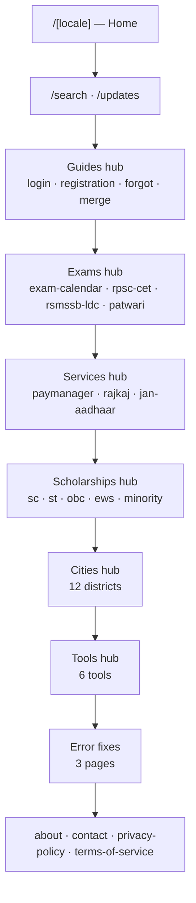
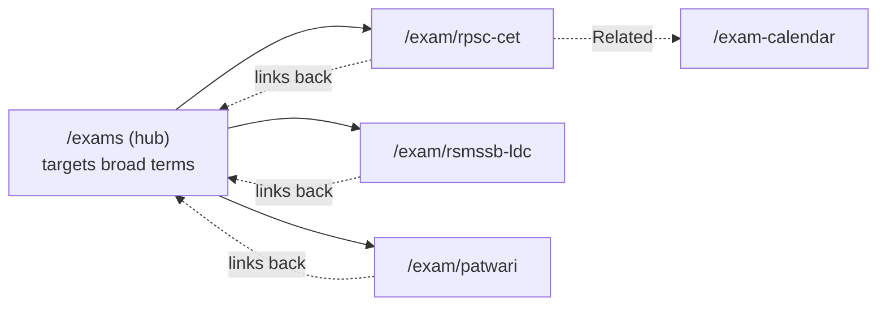
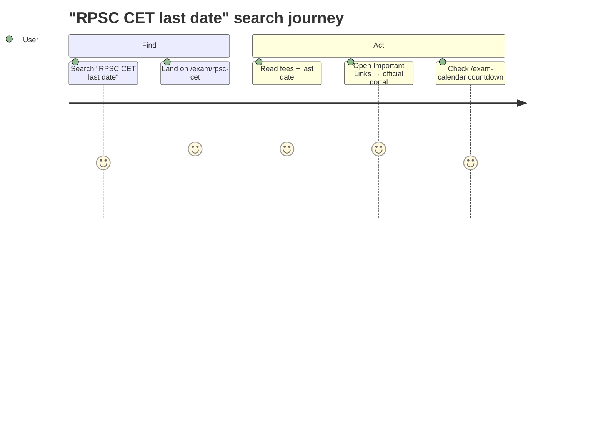

# Pages and Flow

The current live structure of the site, the page types, and how visitors move through them.

## Site map

> [!note] Reading the diagram
> The vertical arrows stack the sections top-to-bottom for easy reading — they are **not** a navigation sequence. Every hub is reached directly from Home, and each label lists that hub's spoke pages.

> [!note] SEO files
> `/sitemap.xml` and `/robots.txt` are generated by `sitemap.ts` and `robots.ts`; `/humans.txt` is a static asset. `/scholarship` and `/city` (without a slug) redirect to their hubs.

## Hub and spoke model

The site uses a hub-and-spoke structure. A **hub** is a category listing page; a **spoke** is an individual detail page.

Hubs target broad search terms and funnel visitors to specific detail pages. Detail pages link back to their hub and to related pages, which increases pages per session and internal link strength.

## Navigation

The header contains:

- **Standalone links:** Updates (with a "New" marker) and Calendar.
- **Dropdown menus:** Guides, Exams, Services, Tools, Help (Help includes About, Contact, Cities, Sitemap, Privacy, Terms).
- A search icon and a language switch.

The footer contains grouped link columns (Guides, Explore, Help and Info), a contact row (email, WhatsApp, official portal), social links, and the attribution badge.

Every content page also shows a breadcrumb trail.

## Page types and their blocks

| Page type | Count (per locale) | Main blocks |
|-----------|:--:|-------------|
| Home | 1 | Hero, quick links, latest updates, explainer, categories, steps, who-needs/documents tables, internal links, FAQ, safety tips, contact CTA |
| Guide | 4 | Official-portal CTA, article body, steps, FAQ, WhatsApp share, Important Links, Related |
| Exam | 3 | Fee cards, detailed content, linked services, Important Links, Related |
| Exam Calendar | 1 | Visual month calendar, date table with live countdown |
| Service | 3 | Purpose, generated content, Important Links, Related |
| Scholarship | 5 | Eligibility, application steps, generated content, Important Links, Related |
| City | 12 | Local intro, CTA, generated content, Related |
| Error fix | 3 | Problem statement, step-by-step fixes, HowTo + Breadcrumb schema |
| Hub pages | 6 | Card/list grid, ItemList structured data, breadcrumb |
| Tools | 6 + hub | Interactive tool interface, short instructions |
| Updates | 1 | Full dated feed, WhatsApp share |
| Search | 1 | Instant client-side search across all pages |
| Trust / legal | 4 | About, Contact, Privacy Policy, Terms of Service |

## Typical user journeys

Other common paths:

- **"Forgot my SSO ID"** → `/forgot-sso-id` → steps → WhatsApp share → official portal.
- **Browsing exams** → Exams menu → `/exams` → pick an exam → calendar → countdown.
- **Quick lookup** → search icon → type "patwari" → jump to the page.

## Related

[[02 - Architecture]] · [[04 - Content Inventory]] · [[README]]
