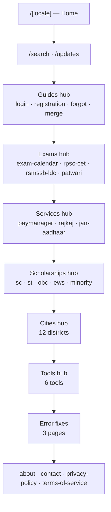
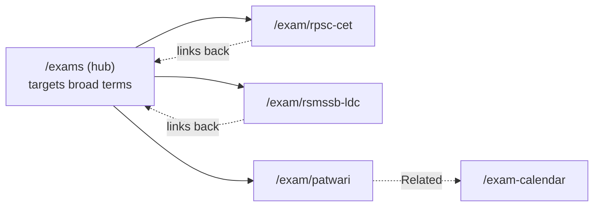
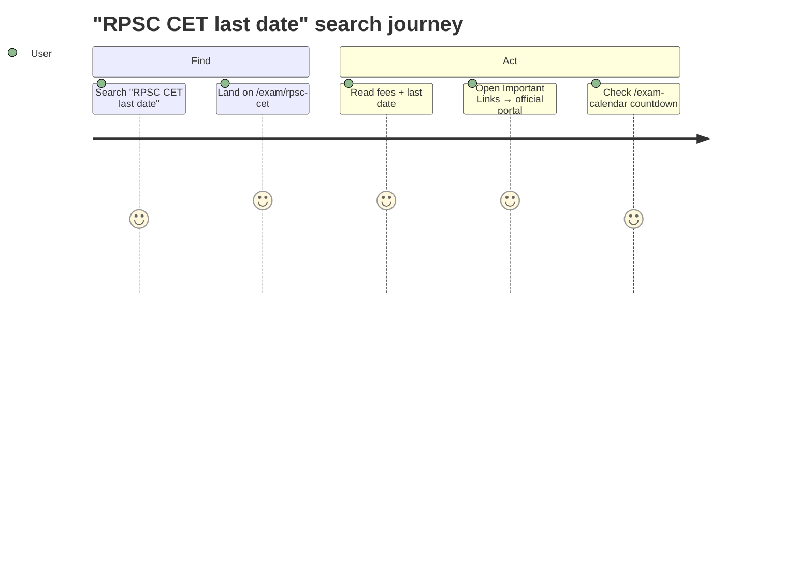

# 03 · Routing and Pages

> [!abstract] The live structure of the site, the page types, and how visitors move through them.

## 🗺️ Site map

> [!note] Reading the diagram
> The vertical arrows stack sections top-to-bottom for readability — they are **not** a navigation sequence. Every hub is reached directly from Home.

> [!note] SEO endpoints
> `/sitemap.xml` and `/robots.txt` are generated by `sitemap.ts` / `robots.ts`; `/humans.txt` is a static asset. `/scholarship` and `/city` (no slug) **redirect** to their hubs.

## 🕸️ Hub-and-spoke model

A **hub** is a category listing page targeting broad terms; a **spoke** is a detail page. Spokes link back to their hub and to related pages, raising pages-per-session and internal link strength.

## 🧭 Navigation

**Header** contains:
- **Standalone links:** Updates (with a "New" marker) and Calendar.
- **Dropdown menus:** Guides, Exams, Services, Tools, Help (About, Contact, Cities, Sitemap, Privacy, Terms).
- A search icon and a language switch.

**Footer** contains grouped link columns (Guides · Explore · Help & Info), a contact row (email, WhatsApp, official portal), social links, and the attribution badge.

Every content page also shows a **breadcrumb** trail.

## 📄 Page types & their blocks

| Page type | Count / locale | Main blocks |
|-----------|:--:|-------------|
| **Home** | 1 | Hero+byline+stats, share bar, quick-action table, SMS callout, answer box, why/who, service groups, login steps, tables, registration/recovery, OTR+fees, Jan Aadhaar, internal links, cities, errors, FAQ, safety, About/E-E-A-T + 9 sources |
| Guide | 4 | Portal CTA, article body, steps, FAQ, WhatsApp share, Important Links, Related |
| Exam | 3 | Fee cards, detailed content, linked services, Important Links, Related |
| Exam Calendar | 1 | Visual month calendar + date table with live countdown |
| Service | 3 | Purpose, content (paymanager = rich), Important Links, Related |
| Scholarship | 5 | Eligibility, steps, generated content, Important Links, Related |
| City | 12 | Local intro, CTA, generated content, Related |
| Error fix | 3 | Problem statement, step-by-step fixes, HowTo + Breadcrumb schema |
| Hub pages | 6 | Card/list grid, ItemList schema, breadcrumb |
| Tools | 6 + hub | Interactive tool + short instructions |
| Updates | 1 | Full dated feed, WhatsApp share |
| Search | 1 | Instant client-side search (noindex) |
| Trust / legal | 4 | About, Contact, Privacy, Terms |

> [!info] The home page is special
> After the June 2026 upgrade it carries the most content and schema on the site (WebPage + GovernmentService + 4× HowTo + FAQPage + Breadcrumb). See [[06 - SEO and Structured Data]] and [[13 - Changelog]].

## 🚶 Typical user journeys

Other common paths:
- **"Forgot my SSO ID"** → `/forgot-sso-id` → steps (incl. SMS `RJ SSO` to 9223166166) → share → official portal.
- **Browsing exams** → Exams menu → `/exams` → pick exam → calendar countdown.
- **Quick lookup** → search icon → type "patwari" → jump.

---

## 🔗 Related

[[02 - Architecture]] · [[04 - Data Model]] · [[05 - Content Inventory]] · [[README]]
