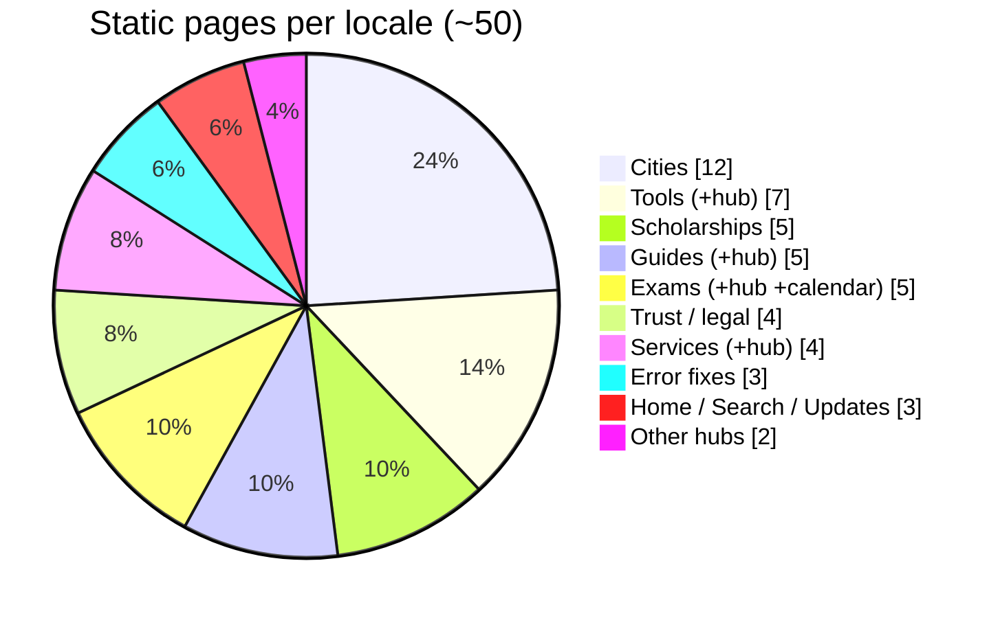

# Content Inventory

A page-by-page breakdown of what content lives on each page, approximate word counts, and a review score. Word counts are approximate, per language, and cover visible body copy. Because every page exists in two languages, the real totals are roughly double.

## Page distribution (per locale)

## Scoring system

Each page type is scored from 1 to 5 on four dimensions, then given an overall score and a status.

- **Score scale:** 5 excellent, 4 good, 3 fair, 2 weak, 1 poor.
- **Dimensions:** content depth, SEO, internal links, trust and accuracy.
- **Status:** Ready, Verify data, or Expand later.

## Home page

URL: `/en`, `/hi`. Approx words: 2,800 per language.

Contains: hero with login and registration buttons, three stat cards, quick-access links, latest updates feed, "What is SSO ID" explainer, why-it-matters points, three user-category cards, four major-service cards, eight benefit points, login and registration steps, who-needs / documents / quick-reference tables, popular-services grid, internal link lists, city chips, common-errors table, FAQ, safety tips, and a contact call-to-action.

| Depth | SEO | Links | Trust | Overall | Status |
|:--:|:--:|:--:|:--:|:--:|:--|
| 5 | 5 | 5 | 4 | 5 | Ready |

## Core guides (4 pages)

URLs: `/sso-id-login`, `/sso-id-registration`, `/forgot-sso-id`, `/merge-sso-id`. Approx words: 480 each per language.

Contains: official-portal call-to-action, intro, last-verified date, four body paragraphs, numbered steps, FAQ, WhatsApp share, Important Links box, Related links. Schema: Article + HowTo + FAQPage + Breadcrumb.

| Page | Depth | SEO | Links | Trust | Overall | Status |
|------|:--:|:--:|:--:|:--:|:--:|:--|
| SSO Login | 5 | 5 | 5 | 5 | 5 | Ready |
| Registration | 5 | 5 | 5 | 5 | 5 | Ready |
| Forgot SSO ID | 5 | 5 | 5 | 5 | 5 | Ready |
| Merge SSO ID | 4 | 4 | 5 | 5 | 4 | Ready |

## Exam pages (3 pages)

URLs: `/exam/rpsc-cet`, `/exam/rsmssb-ldc`, `/exam/patwari`. Approx words: 470 each per language (generated body + hand-written `examContent.ts`).

Contains: fee cards (general, SC/ST, last date), detailed paragraphs, linked services, Important Links box, Related links, breadcrumb.

| Page | Depth | SEO | Links | Trust | Overall | Status |
|------|:--:|:--:|:--:|:--:|:--:|:--|
| RPSC CET | 5 | 5 | 4 | 3 | 4 | Verify dates and fees |
| RSMSSB LDC | 5 | 5 | 4 | 3 | 4 | Verify dates and fees |
| Patwari | 5 | 5 | 4 | 3 | 4 | Verify dates and fees |

## Service pages (3 pages)

URLs: `/service/paymanager`, `/service/rajkaj`, `/service/jan-aadhaar`. Approx words: 210 each per language.

| Depth | SEO | Links | Trust | Overall | Status |
|:--:|:--:|:--:|:--:|:--:|:--|
| 3 | 4 | 4 | 4 | 3 | Expand content and add FAQs |

## Scholarship pages (5 pages)

URLs: `/scholarship/sc`, `/st`, `/obc`, `/ews`, `/minority`. Approx words: 200 each per language.

| Depth | SEO | Links | Trust | Overall | Status |
|:--:|:--:|:--:|:--:|:--:|:--|
| 3 | 4 | 4 | 3 | 3 | Verify income limits |

## City pages (12 pages)

URLs: `/city/jaipur` through `/city/sri-ganganagar`. Approx words: 210 each per language.

Cities covered: Jaipur, Jodhpur, Kota, Udaipur, Ajmer, Bikaner, Alwar, Bharatpur, Sikar, Bhilwara, Pali, Sri Ganganagar.

| Depth | SEO | Links | Trust | Overall | Status |
|:--:|:--:|:--:|:--:|:--:|:--|
| 3 | 4 | 4 | 4 | 3 | Add more districts |

## Error-fix pages (3 pages)

URLs: `/error/captcha-not-loading`, `/error/server-busy`, `/error/id-already-exists`. Approx words: 120 each per language.

Contains: problem statement, step-by-step fixes, HowTo and breadcrumb structured data.

> [!warning] Correction from earlier docs
> Only **3** error pages exist in `errors.json` today (not 6). [[12 - Improvements and Recommendations]] lists adding more.

| Depth | SEO | Links | Trust | Overall | Status |
|:--:|:--:|:--:|:--:|:--:|:--|
| 3 | 4 | 2 | 4 | 3 | Add related links + more errors |

## Hub pages (6 pages)

URLs: `/guides`, `/exams`, `/services`, `/scholarships`, `/cities`, `/updates`. The `/exams` hub is long-form (`examsHub.ts`); the others are ~120 words plus a card grid.

Contains: heading, intro, card or list grid of all items, ItemList structured data, breadcrumb.

| Depth | SEO | Links | Trust | Overall | Status |
|:--:|:--:|:--:|:--:|:--:|:--|
| 3 | 5 | 5 | 4 | 4 | Ready |

## Exam Calendar

URL: `/exam-calendar`. Approx words: 120 plus a visual calendar and table with a live client-side countdown.

| Depth | SEO | Links | Trust | Overall | Status |
|:--:|:--:|:--:|:--:|:--:|:--|
| 4 | 4 | 4 | 3 | 4 | Verify dates |

## Tools (6 pages plus hub)

URLs: `/tools` plus six tool pages (`otr-fee-calculator`, `age-calculator`, `sso-id-validator`, `scholarship-calculator`, `photo-resizer`, `jan-aadhaar-status`). Approx words: 80 each, since these are interactive.

All run in the browser; no data leaves the device.

| Depth | SEO | Links | Trust | Overall | Status |
|:--:|:--:|:--:|:--:|:--:|:--|
| 3 | 3 | 3 | 5 | 3 | Ready |

## Trust and legal pages

| Page | Approx words | Overall | Status |
|------|:--:|:--:|:--|
| About | 280 | 4 | Ready |
| Contact | 300 | 4 | Ready |
| Privacy Policy | 600 | 5 | Ready |
| Terms of Service | 500 | 5 | Ready |
| Search | interactive | 3 | Ready |

## Summary

| Section | Pages (×2 languages) | Avg words | Overall | Priority action |
|---------|:--:|:--:|:--:|------|
| Home | 1 | 2,800 | 5 | None |
| Core guides | 4 | 480 | 5 | None |
| Exams | 3 | 470 | 4 | Verify dates and fees |
| Services | 3 | 210 | 3 | Expand and add FAQs |
| Scholarships | 5 | 200 | 3 | Verify income limits |
| Cities | 12 | 210 | 3 | Add more districts |
| Error fixes | 3 | 120 | 3 | Add related links + more errors |
| Hubs | 6 | 120 (exams more) | 4 | None |
| Exam Calendar | 1 | 120 + UI | 4 | Verify dates |
| Tools | 7 | 80 | 3 | None |
| Trust and legal | 5 | 450 | 5 | None |

> [!abstract] Totals
> About **50 pages per language**, roughly **100 overall**. Estimated visible content: ~14,000 words per language, ~28,000 across both.

## Priority content actions

1. **Verify all exam dates, fees, and scholarship income limits** against official sources. Highest priority — accuracy drives trust and rankings.
2. Expand service and scholarship pages with four to five FAQs each.
3. Add more exams (REET, RAS), services, and the remaining Rajasthan districts.
4. Add related-links blocks and more entries to the error-fix pages.
5. Add screenshots to the login and registration guides.

## Related

[[03 - Pages and Flow]] · [[06 - Maintenance Guide]] · [[07 - Launch Review]] · [[12 - Improvements and Recommendations]] · [[README]]
