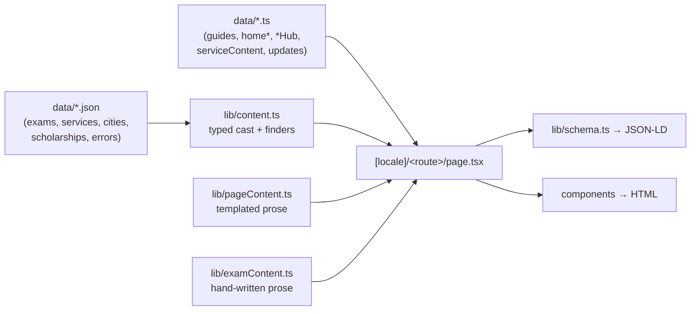
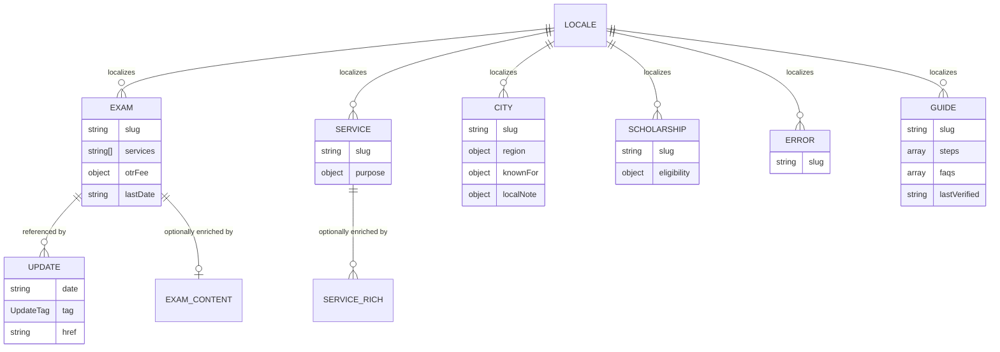

# 04 · Data Model

> [!abstract] Every content source, its TypeScript shape, and how it flows to a page. This is the map for "where does this text live?"

## 🧬 How data flows to a page

## 🗃️ Entity relationships

## 📦 JSON data (via `lib/content.ts`)

All bilingual fields use `Localized = Record<Locale, string>`. `content.ts` casts each file and exposes finders: `getExam`, `getService`, `getCity`, `getError`, `getScholarship`.

| File | Shape | Key fields | Count |
|------|-------|-----------|:-----:|
| `exams.json` | `Exam[]` | `slug`, `name`, `fullName`, `otrFee {general, sc_st}`, `lastDate`, `examDate?`, `services[]`, `keywords` | 3 |
| `services.json` | `Service[]` | `slug`, `name`, `purpose` | 3 |
| `cities.json` | `City[]` | `slug`, `name`, `region`, `knownFor`, `localNote` | 12 |
| `scholarships.json` | `Scholarship[]` | `slug`, `name`, `eligibility` | 5 |
| `errors.json` | `SsoError[]` | `slug`, problem, fixes | 3 |

> [!example]- Slugs at a glance
> **Exams:** `rpsc-cet`, `rsmssb-ldc`, `patwari`
> **Services:** `paymanager`, `rajkaj`, `jan-aadhaar`
> **Scholarships:** `sc`, `st`, `obc`, `ews`, `minority`
> **Cities:** `jaipur`, `jodhpur`, `kota`, `udaipur`, `ajmer`, `bikaner`, `alwar`, `bharatpur`, `sikar`, `bhilwara`, `pali`, `sri-ganganagar`
> **Errors:** `captcha-not-loading`, `server-busy`, `id-already-exists`
> **Guides:** `sso-id-login`, `sso-id-registration`, `forgot-sso-id`, `merge-sso-id`

## 🧾 TypeScript content modules (`src/data`)

| File | Exports | Powers |
|------|---------|--------|
| `guides.ts` | `guides` (4), `getGuide()` | `/[guide]` — full title/intro/body/steps/faqs/`lastVerified` |
| `home.ts` | `homeContent` | Home core sections (meta, h1, what/why/who, login/register steps, FAQs, safety) |
| `homeGuide.ts` | `homeGuide` | Home who-needs/documents/registration/recovery/errors/quick-ref tables |
| `homeExtra.ts` | `homeExtra` | Home OTR/merge/Jan-Aadhaar/helpline blocks + disclaimer |
| `homeMeta.ts` | `homeMeta` | **June 2026 GEO adds:** dates, byline, direct answer, quick-action rows, SMS recovery, About body, author bio, 9 cited sources |
| `serviceGroups.ts` | `serviceGroups` | Home "services by audience" grid |
| `serviceContent.ts` | `serviceContent` | Rich per-service content (**paymanager** fully written; others fall back) |
| `examsHub.ts` / `guidesHub.ts` / `servicesHub.ts` / `scholarshipsHub.ts` / `toolsHub.ts` / `updatesHub.ts` | hub long-form + FAQ | Hub pages |
| `updates.ts` | `sortedUpdates`, `isRecent()`, `UpdateTag` | Updates feed (newest-first; "New" ≤ 21 days) |

## 🌍 Localization pattern

> [!tip] The golden rule
> A displayed string is **always** `something[loc]`. If you add a field that users see, it must be `Record<Locale, T>` with both `en` and `hi`. A missing Hindi value is the most common content bug — see the bilingual-parity guard idea in [[12 - Roadmap and Improvements]].

## 🖼️ Assets & site config (`lib/site.ts`)

Single source of truth. Notable entries:

| Key | Value |
|-----|-------|
| `url` | `https://rajssoidguide.in` |
| `officialPortal` | `https://sso.rajasthan.gov.in` |
| `geo` | `region IN-RJ`, `placename Jaipur`, `position 26.9124;75.7873`, `icbm` |
| `assets.ogImage.en` | `/RajSSO/sso-id-rajasthan-2026-og-image-en.webp` |
| `assets.ogImage.hi` | `/RajSSO/sso-id-rajasthan-2026-og-image-hi.webp` |
| `social.twitter` | `@rajssoguide` |
| `contactEmail` | `contact@rajssoidguide.in` |

---

## 🔗 Related

[[02 - Architecture]] · [[05 - Content Inventory]] · [[09 - Maintenance Guide]] · [[README]]
