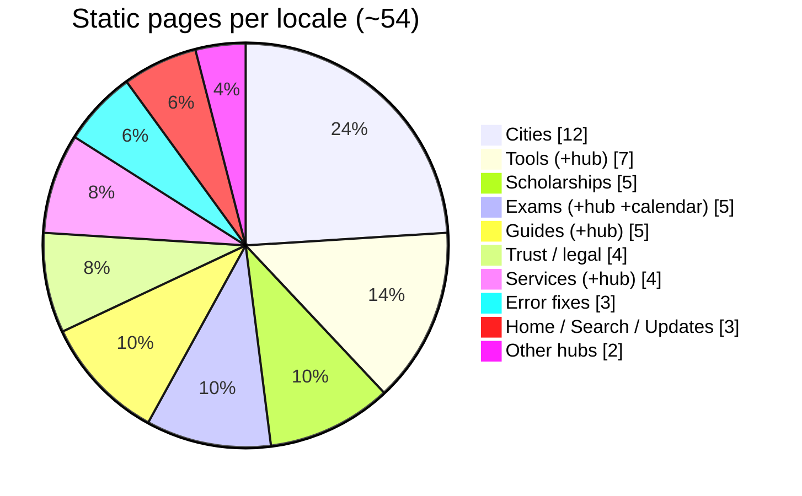

# 05 · Content Inventory

> [!abstract] Page-by-page content depth and review scores. Verified against the source on 27 June 2026. Word counts are approximate, **per language** — real totals are ~double.

## 🥧 Page distribution (per locale)

## 📏 Scoring key

- **Scale:** 5 excellent · 4 good · 3 fair · 2 weak · 1 poor.
- **Dimensions:** content depth · SEO · internal links · trust/accuracy.
- **Status:** ✅ Ready · 🔶 Verify data · 🔜 Expand later.

## 🟢 RICH — strong unique content

| Page(s) | Depth | SEO | Links | Trust | Status |
|---------|:--:|:--:|:--:|:--:|:--|
| **Home** (`/`) | 5 | 5 | 5 | 5 | ✅ Ready |
| Core guides ×4 (`/sso-id-login`, `/sso-id-registration`, `/forgot-sso-id`, `/merge-sso-id`) | 5 | 5 | 5 | 5 | ✅ Ready |
| Exam details ×3 (`/exam/*`) | 5 | 5 | 4 | 3 | 🔶 Verify dates & fees |
| `/service/paymanager` | 5 | 5 | 5 | 4 | ✅ Ready |
| Hubs: `/services`, `/guides`, `/tools`, `/exams`, `/updates`, `/scholarships` | 3–5 | 5 | 5 | 4 | ✅ Ready |
| Legal: `/privacy-policy`, `/terms-of-service` | 5 | 4 | 3 | 5 | ⚠️ add JSON-LD |

> [!success] Home page (post-upgrade)
> ~3,000+ words/locale. Blocks: hero + author byline + last-updated badge, share bar, quick-action table, SMS recovery callout, direct-answer box (`#what-is-sso`), why/who, service groups, login steps, who-needs/documents tables, registration & recovery, OTR + fee table, merge, Jan Aadhaar, internal links, cities, errors table, FAQ, safety tips, **About/E-E-A-T block with 9 cited sources**, contact CTA.

## 🟡 MODERATE / TEMPLATED — duplication risk

> [!warning] The main SEO weakness
> These render real content from a **fixed 3-paragraph template** (`lib/pageContent.ts`) with variables swapped in, so items in each group look near-identical to search engines.

| Page group | Items | Issue |
|------------|:--:|-------|
| `/city/[slug]` | 12 | Same body template (name/region/knownFor differ). ✅ Now has unique meta description + city FAQ + FAQPage schema (2026-07-06); still the highest dup risk on body prose — add per-city facts later. |
| `/scholarship/[category]` | 5 | Same body template. ✅ Now has FAQ + FAQPage schema + unique meta (2026-07-06); numeric income limits/amounts still pending. |
| `/error/[code]` | 3 | Unique but brief. ✅ Now has related-links block + localized breadcrumb (2026-07-06). |
| `/about`, `/contact` | — | Decent but light; contact is mostly details + form. |
| `/exam-calendar` | 1 | Table + widget, minimal prose, no FAQ. |

## 🔵 THIN / FUNCTIONAL — intentional or minimal

| Page | Note |
|------|------|
| `/city`, `/scholarship` (singular) | Pure redirects to hubs — intentional ✅ |
| `/search` | Search box only; correctly `noindex` ✅ |
| `/tools/*` (6) | Client tool + 3 unique paragraphs + breadcrumb; no FAQ — acceptable for tools |

## 📊 Summary

| Section | Pages ×2 | Avg words | Overall | Priority action |
|---------|:--:|:--:|:--:|------|
| Home | 1 | 3,000+ | 5 | None |
| Core guides | 4 | 480 | 5 | None |
| Exams | 3 | 470 | 4 | 🔶 Verify dates & fees |
| Services | 3 | paymanager/rajkaj/jan-aadhaar all bespoke ✅ | 5 | Done (2026-07-06) |
| Scholarships | 5 | 200 | 3 | 🔶 Verify income limits |
| Cities | 12 | 210 | 3 | 🔜 De-duplicate / add district detail |
| Error fixes | 3 | 120 | 3 | 🔜 Add related links + more errors |
| Hubs | 6 | 120+ | 4 | None |
| Exam Calendar | 1 | 120 + UI | 4 | 🔶 Verify dates |
| Tools | 7 | 80 | 3 | None |
| Trust & legal | 5 | 450 | 5 | ⚠️ add schema to legal |

> [!abstract] Totals
> ~**54 pages/language**, ~**108 overall**. Estimated visible content ~15,000 words/language.

## 🎯 Priority content actions

1. **Verify** all exam dates/fees and scholarship income limits against official sources (highest priority — still open).
2. ~~Write bespoke content for `/service/rajkaj` and `/service/jan-aadhaar`~~ ✅ Done 2026-07-06.
3. **De-duplicate** the 12 city page bodies further with per-city facts (FAQ + schema already added).
4. ~~Add FAQ to templated detail pages; add WebPage schema to legal pages~~ ✅ Done 2026-07-06 (city, scholarship, privacy, terms).
5. Add more exams (REET, RAS) and error pages (OTP not received, session timeout, name mismatch).

Use [[10 - Content Playbook]] for templates. Full backlog: [[12 - Roadmap and Improvements]].

---

## 🔗 Related

[[03 - Routing and Pages]] · [[06 - SEO and Structured Data]] · [[10 - Content Playbook]] · [[12 - Roadmap and Improvements]] · [[README]]
