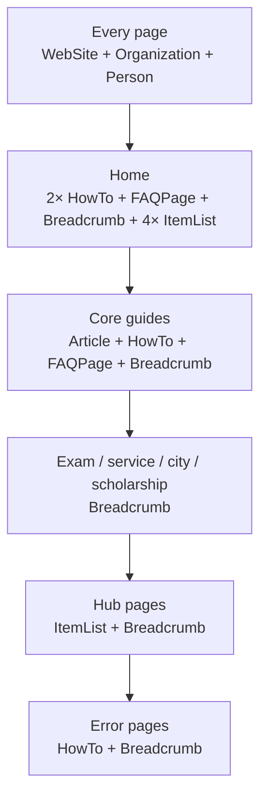

# SEO, Security, and Performance

## SEO system

### Metadata

`app/[locale]/layout.tsx` sets the base metadata: `metadataBase`, the title template (`%s | RajSSO Guide`), description, authors/creator/publisher fields, icons, manifest, Open Graph image per locale, Twitter card, a Google site-verification token, and attribution `other` tags.

Each page adds its own `title`, `description`, and an `alternates` block with a canonical URL and hreflang language entries.

### Structured data (JSON-LD)

Built by `lib/schema.ts` and injected with the `JsonLd` component as a single `@graph` document.

> [!note] Reading the diagram
> The top node lists the schema present on **every** page. The nodes below are stacked vertically for readability — each one shows the **extra** schema added for that page type, on top of the global base.

- **Global (every page):** WebSite, Organization, Person — note the `Person` node is the developer-attribution schema from `attribution.ts`.
- **Home:** two HowTo blocks (login and registration), an FAQPage, a Breadcrumb, and four ItemList nodes (exams, scholarships, services, cities).
- **Core guides:** Article, HowTo, FAQ, Breadcrumb.
- **Exam, service, city, scholarship:** Breadcrumb.
- **Error pages:** HowTo and Breadcrumb.
- **Hub pages:** ItemList and Breadcrumb.

### Sitemap and robots

- `sitemap.ts` (`force-static`) lists the home page, all hubs, guides, tools, exams, services, scholarships, cities, error pages, and legal pages — one entry per locale, each with a priority and change frequency. It deliberately omits the `alternates` field for Google Search Console compatibility.
- `robots.ts` allows the main search crawlers (Googlebot, Bingbot, DuckDuckBot, Slurp, `*`), **blocks known AI scrapers** (GPTBot, ChatGPT-User, CCBot, anthropic-ai, Claude-Web), disallows `/_next/`, `/api/`, `*.json`, and `/*/not-found`, and declares the sitemap.

### Internal linking

Hub-and-spoke structure, visible breadcrumbs, "Related" blocks (`related.ts`), and "Important Links" boxes all reinforce internal linking. The `/search` page and `searchIndex.ts` cover findability within the site.

### Hreflang and canonicals

`lib/schema.ts` provides `alternates()` (en-IN, hi-IN, x-default) and `canonicalFor()`. The `<html lang>` attribute is set per locale from `hreflangMap`.

## Security

Defined in `next.config.ts` as headers applied to all routes (`/:path*`):

| Header | Value | Purpose |
|--------|-------|---------|
| `X-Built-By` | Kamlesh Choudhary (devxkamlesh.com) | Attribution |
| `X-Frame-Options` | SAMEORIGIN | Clickjacking protection |
| `X-Content-Type-Options` | nosniff | MIME sniffing protection |
| `Referrer-Policy` | strict-origin-when-cross-origin | Referrer privacy |
| `Permissions-Policy` | camera=(), microphone=(), geolocation=() | Disables sensitive APIs |
| `Content-Security-Policy` | see below | XSS / injection mitigation |

The CSP allows `'self'` plus Google Tag Manager, Google Analytics, and Cloudflare Insights (`static.cloudflareinsights.com`, `cloudflareinsights.com`), with `'unsafe-inline'`/`'unsafe-eval'` for scripts and inline styles, and `frame-ancestors 'self'`.

> [!caution] CSP hardening opportunity
> The script CSP uses `'unsafe-inline'` and `'unsafe-eval'`. Tightening this with nonces/hashes is tracked in [[12 - Improvements and Recommendations]].

Additional points:

- No secrets are stored in code. The Google Analytics ID (`G-RYT943398Y`) is a public measurement ID embedded in the layout.
- Links to the official portal use `rel="nofollow noopener"`.
- The interactive tools never transmit user data; all computation is local.

## Performance

- Every page is statically generated, so there is no server render time on request; Cloudflare serves assets from the edge.
- Client JavaScript is limited to the header menu, search, the live countdown, and the tools.
- Images use `images.unoptimized: true` because assets are pre-optimized (WebP), which avoids runtime image processing on the Worker.
- Fonts are loaded through `next/font` (Geist Sans + Geist Mono).
- The locale layout preloads the horizontal logo and adds `dns-prefetch`/`preconnect` for Google Tag Manager.
- Google Analytics loads with `strategy="lazyOnload"` so it does not block first paint.

## Accessibility notes

- A skip-to-content link and a labeled `main` landmark (localized label).
- Visible focus styles for keyboard users (`:focus-visible`).
- Reduced-motion support through a media query.
- Semantic HTML and aria labels on navigation and interactive controls.

> [!note] WCAG
> Full WCAG conformance still requires a manual screen-reader pass and expert review before relying on any compliance claim.

## Related

[[02 - Architecture]] · [[07 - Launch Review]] · [[12 - Improvements and Recommendations]] · [[README]]
