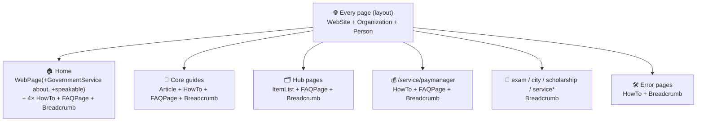

# 06 · SEO and Structured Data

> [!abstract] How metadata, hreflang, JSON-LD, and GEO (generative-engine optimization) signals are produced. Reflects the **June 2026 SEO/GEO upgrade** — see [[13 - Changelog]].

## 🏷️ Metadata

Two layers merge:

1. **Base** — `app/[locale]/layout.tsx`: `metadataBase`, title template `%s | RajSSO Guide`, description, authors/creator/publisher, icons, manifest, per-locale OG image, Twitter card, Google site-verification, attribution `other` tags.
2. **Per page** — each `page.tsx` adds `title`, `description`, `alternates` (canonical + hreflang), and richer tags.

> [!info] Home page metadata (locale-aware)
> The home `generateMetadata` sets, per locale (`en`/`hi`):
> - `keywords` (localized), `alternates.canonical` + hreflang
> - **OpenGraph** `type: article`, `locale` + `alternateLocale`, `publishedTime`/`modifiedTime`, `authors`, image with `secureUrl` + localized `alt`
> - **Twitter** `creator: @devxkamlesh`
> - **`other`**: `article:author` (LinkedIn), `article:published_time`/`modified_time`, localized `article:section` + `article:tag[]`, `revisit-after`, enhanced `bingbot`, and `geo.region`/`geo.placename`/`geo.position`/`ICBM` from `site.geo`.

## 🧩 Structured data (JSON-LD)

Built by `lib/schema.ts`, injected via the `JsonLd` component as a single `@graph` per page.

> [!warning] ItemList was removed from the Home page
> Google's Rich Results test flagged **"Multiple ListItem elements defined on page"** because the home `@graph` previously stacked **four** `ItemList` nodes (exams, scholarships, services, cities). They were removed on 26 June 2026. `ItemList` now lives only on the dedicated hub pages (one per page = valid). See [[13 - Changelog]].

### Schema builders in `lib/schema.ts`

| Builder | Emits |
|---------|-------|
| `websiteSchema()` | `WebSite` + SearchAction |
| `organizationSchema()` | `Organization` (logo, `sameAs`: X + LinkedIn + GitHub, contactPoint) |
| `personSchema()` | `Person` `@id #author` — **real author** (Kamlesh Choudhary) with `sameAs`, from `attribution.ts` |
| `webPageSchema({...})` | `WebPage` with `datePublished`/`dateModified`, `author`, `reviewedBy`, `isPartOf`, optional `about` + `speakable` |
| `ssoGovernmentService(locale)` | `GovernmentService` (localized name/provider) — used as the home WebPage `about` |
| `articleSchema()` | `Article` (used on core guides) |
| `faqSchema()` / `howToSchema()` / `breadcrumbSchema()` / `itemListSchema()` | FAQ / HowTo / Breadcrumb / ItemList |
| `buildGraph([...])` | Wraps nodes in one `@context` + `@graph` |
| `alternates()` / `canonicalFor()` | hreflang (en-IN, hi-IN, x-default) + canonical URLs |

> [!note] HowTo rich results are deprecated
> Google retired HowTo rich results in 2023. The HowTo nodes remain valid structured data (useful for AI/GEO context) but no longer produce a visual treatment — they are not validator errors.

## 🗺️ Sitemap & robots

- `sitemap.ts` (`force-static`) — home, hubs, guides, tools, exams, services, scholarships, cities, errors, legal; **one entry per locale** with priority + change frequency. Omits `alternates` for Search Console compatibility.
- `robots.ts` — allows Googlebot/Bingbot/DuckDuckBot/Slurp/`*`; **blocks AI scrapers** (GPTBot, ChatGPT-User, CCBot, anthropic-ai, Claude-Web); disallows `/api/`, `/*/not-found`; declares the sitemap.

> [!question] Note the tension: robots blocks AI crawlers, yet the home page adds GEO signals
> The GEO metadata (author, dates, `speakable`, cited sources) helps engines that **are** allowed and improves general E-E-A-T. If you later want Perplexity/ChatGPT to cite the site, relax the AI-scraper block in `robots.ts`. Tracked in [[12 - Roadmap and Improvements]].

## 🔗 Hreflang & canonicals

`alternates()` returns `en-IN`, `hi-IN`, and `x-default → /en`. `canonicalFor(locale, path)` builds the canonical. `<html lang>` is set per locale from `hreflangMap`.

## 🧭 Internal linking & findability

Hub-and-spoke, visible breadcrumbs, `related.ts` "Related" + "Important Links" boxes, and the client `/search` page backed by `searchIndex.ts`.

---

## 🔗 Related

[[02 - Architecture]] · [[07 - Security and Performance]] · [[13 - Changelog]] · [[12 - Roadmap and Improvements]] · [[README]]
