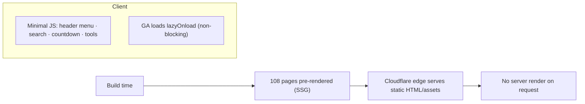

# 07 · Security and Performance

> [!abstract] Headers, CSP, performance model, and accessibility — all defined in `next.config.ts` and the locale layout.

## 🔒 Security headers

Applied to all routes (`/:path*`) in `next.config.ts` `headers()`:

| Header | Value | Purpose |
|--------|-------|---------|
| `X-Built-By` | Kamlesh Choudhary (devxkamlesh.com) | Attribution |
| `X-Frame-Options` | `SAMEORIGIN` | Clickjacking protection |
| `X-Content-Type-Options` | `nosniff` | MIME-sniffing protection |
| `Referrer-Policy` | `strict-origin-when-cross-origin` | Referrer privacy |
| `Permissions-Policy` | `camera=(), microphone=(), geolocation=()` | Disables sensitive APIs |
| `Content-Security-Policy` | see below | XSS / injection mitigation |

### Content-Security-Policy (current)

```text
default-src 'self'
script-src  'self' 'unsafe-inline' 'unsafe-eval'
            https://www.googletagmanager.com
            https://www.google-analytics.com
            https://static.cloudflareinsights.com
style-src   'self' 'unsafe-inline'
img-src     'self' data: https:
font-src    'self' data:
connect-src 'self' https://www.google-analytics.com https://cloudflareinsights.com
frame-ancestors 'self'
```

> [!caution] CSP hardening opportunity
> `script-src` uses `'unsafe-inline'` and `'unsafe-eval'`. Tightening with nonces/hashes (and adding **HSTS**) is tracked in [[12 - Roadmap and Improvements#3. Security hardening]]. GA + GTM rely on inline bootstrapping, so move `gtag-init` to a nonce'd script before removing `'unsafe-inline'`.

### Other security notes

- **No secrets in code.** `G-H7XRW67HZH` is a public GA measurement ID.
- Official-portal links use `rel="nofollow noopener"`.
- Interactive tools **never transmit** user data — all computation is local (privacy by design).

## ⚡ Performance



- Every page is **statically generated** → no request-time server render; Cloudflare serves from the edge.
- Client JS limited to header menu, search, the live countdown, and the tools.
- `images.unoptimized: true` — assets are pre-optimized WebP, avoiding runtime image processing on the Worker.
- Fonts via `next/font` (Geist Sans + Geist Mono).
- Locale layout preloads the horizontal logo and adds `dns-prefetch`/`preconnect` for Google Tag Manager.
- Google Analytics loads with `strategy="lazyOnload"`.

## ♿ Accessibility

- Skip-to-content link + labeled `main` landmark (localized).
- Visible focus styles (`:focus-visible`).
- Reduced-motion support via media query.
- Semantic HTML and aria labels on nav and interactive controls.

> [!note] WCAG claims need a manual pass
> Full WCAG conformance still requires a screen-reader test and expert review before relying on any compliance claim.

---

## 🔗 Related

[[02 - Architecture]] · [[06 - SEO and Structured Data]] · [[08 - Cloudflare Deployment]] · [[12 - Roadmap and Improvements]] · [[README]]
