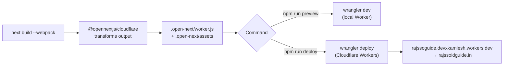

# 08 · Cloudflare Deployment

> [!info] Why OpenNext?
> Next.js 16 does not run natively on Cloudflare Workers. The `@opennextjs/cloudflare` adapter transforms the Next build into a Worker bundle (`.open-next/worker.js`) plus static assets (`.open-next/assets`).

## 🚚 Pipeline



## 🧰 Commands (`package.json`)

| Command | What it does |
|---------|--------------|
| `npm run dev` | Next dev server (`initOpenNextCloudflareForDev()`) |
| `npm run build` | Production build via `next build --webpack` |
| `npm run preview` | `opennextjs-cloudflare build && wrangler dev` — local Worker |
| `npm run deploy` | `opennextjs-cloudflare build && wrangler deploy` — ships to Cloudflare |
| `npm run upload` | `wrangler pages deploy .open-next/assets` (assets-only path) |

> [!warning] Build flag matters
> This branch must build with `next build --webpack`. The default Turbopack build is not what the OpenNext flow expects here.

## 🗝️ Key files

| File | Role |
|------|------|
| `next.config.ts` | `initOpenNextCloudflareForDev()` in dev; locale `redirects()`; security `headers()` (CSP allows Cloudflare Insights); `images.unoptimized` |
| `open-next.config.ts` | `cloudflare-node` wrapper, `edge` converter, dummy incremental cache / tag cache / queue; `edgeExternals: ["node:crypto"]`; `middleware: { external: true }` |
| `wrangler.jsonc` | Worker `name`, `main`, `assets.directory`, compat flags, observability |
| `.open-next/` | Generated build output — **never edit by hand** |

## ⚙️ Wrangler configuration (current, verified)

```jsonc
{
  "name": "rajssoguide",
  "compatibility_date": "2025-03-25",
  "compatibility_flags": ["nodejs_compat"],
  "main": ".open-next/worker.js",
  "assets": { "directory": ".open-next/assets" },
  "observability": {
    "logs": { "enabled": true, "invocation_logs": true },
    "traces": { "enabled": true }
  }
}
```

> [!note] Corrected from older docs
> Earlier documentation showed `compatibility_date: "2024-12-01"` and `nodejs_compat_v2`. The live config is `2025-03-25` and `nodejs_compat`. Wrangler emits a soft warning suggesting a newer compat date — harmless, tracked in [[12 - Roadmap and Improvements]].

## ✅ Deploy steps

1. `npm install` (deps differ from a Vercel-style setup).
2. `npm run lint` and `npm run build`.
3. `npm run preview` — smoke-test `/en` and `/hi` on the local Worker.
4. `npm run deploy` — first time, authenticate with `wrangler login` (already logged in as `kamleshgchoudhary007@gmail.com`).
5. Confirm the custom domain `rajssoidguide.in` routes to the Worker in the Cloudflare dashboard.

## 🐞 Troubleshooting

> [!bug]- `EPERM` / "Permission denied" deleting `.open-next` on Windows (known)
> A leftover **`workerd`** process from a previous `wrangler dev`/preview session locks files in `.open-next`, so the next build can't clean it.
> **Fix:**
> ```powershell
> Get-Process workerd -ErrorAction SilentlyContinue | Stop-Process -Force
> Remove-Item -Recurse -Force .open-next
> npm run deploy
> ```
> If a lock persists, also check for stray `node` processes from an old dev server.

> [!bug]- Other common issues
> - **`node:` import errors at runtime** → confirm `nodejs_compat` in `compatibility_flags`; list the import in `edgeExternals` if needed.
> - **Assets 404 after deploy** → verify `.open-next/assets` exists and `assets.directory` points to it; rebuild if stale.
> - **Locale redirect loops** → the redirect lives in `next.config.ts`; check the `:path` source excludes `en`, `hi`, `_next`, `api`, and dotted files.
> - **CSP blocks a script** → update `script-src`/`connect-src` in `next.config.ts` `headers()`.
> - **Stale build** → delete `.open-next/`, `.next/`, `.wrangler/`, then rebuild.
> - **Windows warning** → OpenNext prints "not fully compatible with Windows"; builds still succeed. WSL is smoother if available.

## 🌍 After deploy: social & search

- Re-scrape OG cards: [Facebook Sharing Debugger](https://developers.facebook.com/tools/debug/) for `/en` and `/hi`.
- In Google Search Console, run the URL inspection / Rich Results test and **Validate Fix** for the ItemList issue (resolved 26 June 2026).
- Submit `sitemap.xml` to Search Console and Bing Webmaster Tools.

## 👀 Observability

Logs + traces are enabled in `wrangler.jsonc`. View with `wrangler tail` or in the dashboard under the Worker's Logs/Observability tab.

---

## 🔗 Related

[[02 - Architecture]] · [[07 - Security and Performance]] · [[09 - Maintenance Guide]] · [[13 - Changelog]] · [[README]]
