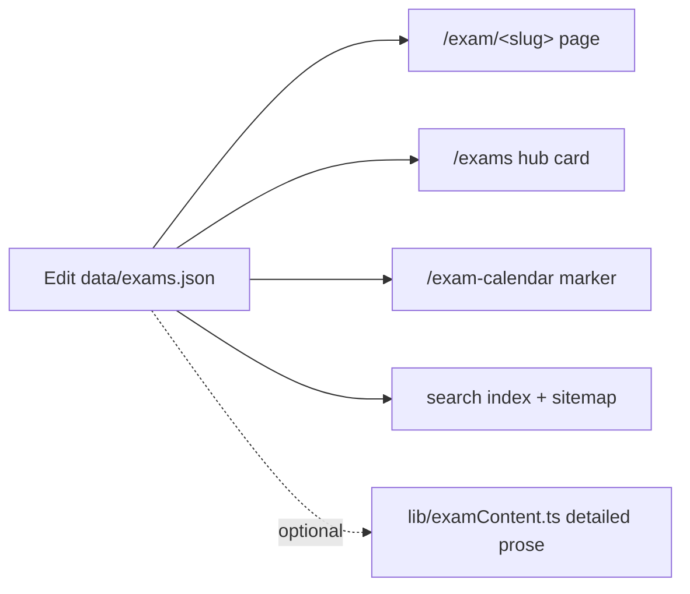

# 09 · Maintenance Guide

> [!tip] The core idea
> In most cases you edit **one data file**. The page, hub listing, sitemap entry, search index, and internal links are generated automatically.

## ➕ Add a new exam

1. Open `src/data/exams.json`.
2. Add an object with `slug`, `name`, `fullName`, `otrFee {general, sc_st}`, `lastDate`, optional `examDate`, `services[]`, `keywords`. Bilingual fields need `en` **and** `hi`.
3. Optional: add detailed prose in `src/lib/examContent.ts` keyed by the same slug.

## ➕ Add a service, city, or scholarship

1. Open `src/data/services.json`, `cities.json`, or `scholarships.json`.
2. Add an object following the existing shape.

> [!tip] Upgrade a service to "rich"
> To give a service bespoke content (like `paymanager`), add an entry to `src/data/serviceContent.ts` keyed by slug → locale. Locales without an entry fall back to the generic `serviceBody()`, so pages never break.

## ➕ Add a core guide

1. Open `src/data/guides.ts`.
2. Add a `Guide` object: `slug`, `title`, `intro`, `body`, `steps`, `faqs`, `lastVerified` — each keyed by locale.

It joins the Guides hub, the header menu, and search automatically.

## 📰 Add a news/update entry

1. Open `src/data/updates.ts`.
2. Add an object at the **top** with `date` (ISO), bilingual `title`, `href`, a `tag` (`exam`/`scholarship`/`service`/`general`), and `external: true` if the link leaves the site.

Sorting and the "New" badge (≤ 21 days) are automatic. Keeping this fresh is the main ongoing SEO task.

## 🏷️ Update the "last updated" date (home page)

> [!important] Do this whenever you review the home page
> Edit `src/data/homeMeta.ts`:
> - `modified` (ISO, e.g. `2026-06-27`)
> - `updatedLabel` (en + hi human text)
> - `sourcesIntro` "Last verified" line (en + hi)
>
> These flow into the visible byline, `article:modified_time`, the WebPage `dateModified`, and OpenGraph `modifiedTime`. Letting them drift makes the "reviewed weekly" claim inaccurate.

## 🈺 Update interface labels

Edit `src/dictionaries/en.json` **and** `hi.json`. Keep keys in sync between the two files.

## ⚙️ Update site-wide settings

Edit `src/lib/site.ts` — name, URL, contact, WhatsApp, social handle, `geo`, and asset/OG-image paths. Single source of truth used across metadata, schema, header, and footer.

## 🖼️ Change OG / social images

Drop new files in `public/RajSSO/` and update `site.assets.ogImage.{en,hi}`. Both OpenGraph and Twitter cards read from there. Current files: `sso-id-rajasthan-2026-og-image-en.webp` / `-hi.webp`.

## 🧑‍💻 Update developer attribution

Edit `src/lib/attribution.ts`. Values are base64-encoded; decode, change, re-encode.

## 🚦 Before committing

- [ ] `npm run lint` — clean.
- [ ] `npm run build` — passes (`next build --webpack`).
- [ ] Both `/en` and `/hi` render as expected.
- [ ] `npm run preview` (Wrangler) to test the Worker output before `npm run deploy`.

## 🔁 Verify regularly

- Exam dates, last dates, and fees vs official RPSC/RSSB notifications.
- Scholarship eligibility and income limits.
- The updates feed.

---

## 🔗 Related

[[04 - Data Model]] · [[08 - Cloudflare Deployment]] · [[10 - Content Playbook]] · [[README]]
