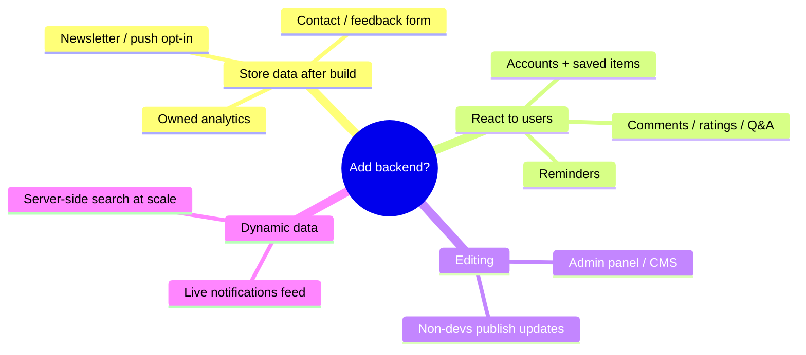

# 11 · Backend and Database

> [!abstract] Should RajSSO Guide add a backend/database? Current setup, what a backend enables, options, tradeoffs, and a recommendation.

## 📍 Current setup

No backend, no database. Every page is generated at build time and served as static files from the Cloudflare edge. Content lives in the repo. The only runtime logic is the lightweight `middleware.ts` (locale header). Tools run in the browser.

> [!success] This is the ideal baseline
> Simplest, fastest, cheapest, most secure architecture for an informational site. Add a backend **only** for a specific feature that genuinely needs one.

## 🔓 What a backend/database would enable

If none of these are needed, a backend adds cost and risk with no benefit.

## 🧰 Options (lightest → heaviest)

| Option | Good for | Cost/complexity |
|--------|----------|-----------------|
| Serverless function / Worker route | One task (e.g. form POST) | Low |
| Backend-as-a-service (Supabase, Firebase) | Managed DB + auth + storage | Low–Med |
| Headless / Git-based CMS (Sanity, Contentful, Strapi) | Non-dev editing + rebuild | Med |
| Full custom backend (Node + Postgres/Mongo) | Max control | High |

> [!tip] Cloudflare-native options (you already run on Workers)
> - **D1** — serverless SQLite; ideal for form submissions or a small structured dataset.
> - **KV** — low-latency key/value for counters, flags, cached lookups.
> - **R2** — object storage (user uploads) with no egress fees.
> - **Workers / Queues** — handle a form POST or background job in the same Worker.
> - **Durable Objects** — coordination/state when genuinely needed.
>
> These bind directly in `wrangler.jsonc`, so a "report incorrect info" endpoint could ship as one Worker route + a D1 table.

## ⚖️ Tradeoffs

> [!success]- Pros
> Dynamic content without redeploys · user-specific features · owned data · non-dev editing · interactivity · large-scale search/filtering.

> [!failure]- Cons
> Higher cost · more complexity · potentially slower pages · security/privacy burden · maintenance & uptime · SEO risk if content moves to client fetching · operational overhead (migrations, secrets, scaling).

## 🎯 Recommendation

> [!important] Keep the static architecture as the default
> It directly serves the project's goals: speed on cheap phones, low cost, strong SEO, minimal risk.

Add capability only for a justified need, smallest piece first:
- **Non-dev editing** → Git-based or headless CMS with a rebuild trigger (keeps static speed).
- **Form / subscriptions** → one Worker route + **D1** (not a full server).
- **Accounts / comments / personalisation** → defer until there is clear demand and steady traffic (highest cost + privacy responsibility).

There is no need to add a database now.

---

## 🔗 Related

[[01 - Overview]] · [[02 - Architecture]] · [[12 - Roadmap and Improvements]] · [[README]]
