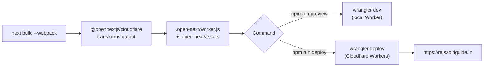

# Cloudflare Deployment

How the `cloudflare` branch builds and ships to **Cloudflare Workers** using the OpenNext adapter. For the Vercel path, see `DEPLOYMENT-BRANCHES.md` in the repo root.

> [!info] Why OpenNext?
> Next.js 16 does not run natively on Cloudflare Workers, and its middleware is Node-only. The `@opennextjs/cloudflare` adapter transforms the Next.js build into a Worker bundle (`.open-next/worker.js`) plus static assets (`.open-next/assets`).

## Pipeline



## Commands

| Command | What it does |
|---------|--------------|
| `npm run dev` | Next.js dev server (with `initOpenNextCloudflareForDev()`) |
| `npm run build` | Production build via `next build --webpack` |
| `npm run preview` | `wrangler dev` — runs the built Worker locally |
| `npm run deploy` | `wrangler deploy` — deploys the Worker to Cloudflare |
| `npm run upload` | `wrangler pages deploy .open-next/assets` (assets-only path) |

> [!warning] Build flag matters
> This branch must build with `next build --webpack`. The default Turbopack build is not what the OpenNext flow expects here.

## Key files

| File | Role |
|------|------|
| `next.config.ts` | Calls `initOpenNextCloudflareForDev()` in dev; defines locale `redirects()`, security `headers()` (CSP allows Cloudflare Insights), `images.unoptimized` |
| `open-next.config.ts` | OpenNext adapter config — `cloudflare-node` wrapper, `edge` converter, dummy incremental cache / tag cache / queue; `edgeExternals: ["node:crypto"]` |
| `wrangler.jsonc` | `main: .open-next/worker.js`, `assets.directory: .open-next/assets`, `nodejs_compat_v2` flag, observability logs + traces |
| `.open-next/` | Generated build output (do not edit by hand) |

## Wrangler configuration (current)

```jsonc
{
  "name": "rajssoguide",
  "compatibility_date": "2024-12-01",
  "compatibility_flags": ["nodejs_compat_v2"],
  "main": ".open-next/worker.js",
  "assets": { "directory": ".open-next/assets" },
  "observability": {
    "logs": { "enabled": true, "invocation_logs": true },
    "traces": { "enabled": true }
  }
}
```

## Deploy steps

1. `npm install` (dependencies differ from the `main`/Vercel branch).
2. `npm run lint` and `npm run build`.
3. `npm run preview` — smoke-test `/en` and `/hi` on the local Worker.
4. `npm run deploy` — authenticate with Wrangler (`wrangler login`) the first time.
5. Configure the custom domain `rajssoidguide.in` in the Cloudflare Workers dashboard.

## Troubleshooting

> [!bug] Common issues
> - **`node:` import errors at runtime** → confirm `nodejs_compat_v2` is in `compatibility_flags` and the import is listed in `edgeExternals` if needed.
> - **Assets 404 after deploy** → verify `.open-next/assets` exists and `assets.directory` points to it; rebuild if stale.
> - **Locale redirect loops** → the redirect lives in `next.config.ts`, not middleware; check the `:path` source pattern excludes `en`, `hi`, `_next`, `api`, and dotted files.
> - **CSP blocks a script** → update the `script-src`/`connect-src` lists in `next.config.ts` `headers()`.
> - **Stale build** → delete `.open-next/`, `.next/`, and `.wrangler/` then rebuild.

## Observability

Worker logs and traces are enabled in `wrangler.jsonc`. View them with `wrangler tail` or in the Cloudflare dashboard under the Worker's Logs/Observability tab.

## Related

[[02 - Architecture]] · [[05 - SEO Security Performance]] · [[06 - Maintenance Guide]] · [[12 - Improvements and Recommendations]] · [[README]]
