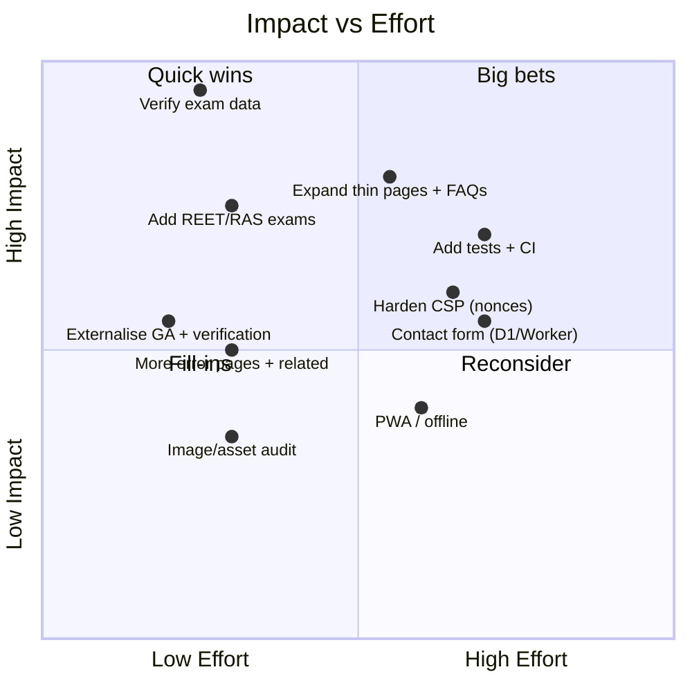
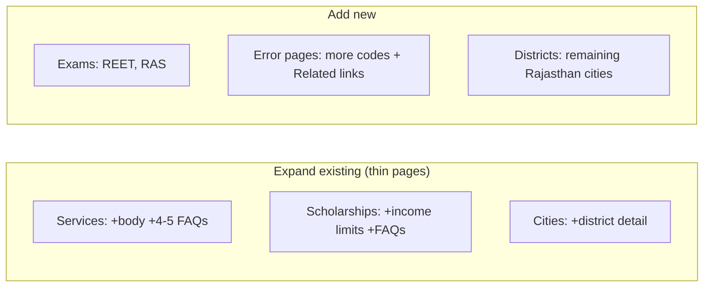

# Improvements and Recommendations

A prioritised, code-grounded backlog for RajSSO Guide. Each item notes the **impact**, the **effort**, and the **files** involved so it can be picked up directly. Items are derived from a full read of the source on the `cloudflare` branch.

> [!abstract] How to use this note
> Start with the [[#Priority matrix]]. Do the "Quick wins" first (high impact, low effort), schedule the "Big bets", and treat "Fill-ins" as good-first-tasks.

## Priority matrix



## Snapshot of what is solid today

> [!success] Strengths worth preserving
> - Clean, data-driven architecture — new content is a JSON/TS edit.
> - Strong SEO scaffolding: per-page metadata, hreflang, JSON-LD `@graph`, sitemap, robots.
> - Fully static + edge-delivered; minimal client JS.
> - Clear non-affiliation/privacy stance; tools run locally.

## 1. Correctness and trust (highest priority)

> [!danger] Do these before promoting the site
> Accuracy is the single biggest driver of trust and ranking for a government-information guide.

| # | Recommendation | Why | Files |
|:-:|----------------|-----|-------|
| 1.1 | Verify every exam **fee, last date, and exam date** against official RPSC/RSSB notifications | Current values are realistic placeholders | `src/data/exams.json`, `src/lib/examContent.ts` |
| 1.2 | Verify scholarship **eligibility and income limits** | Same trust risk | `src/data/scholarships.json` |
| 1.3 | Keep the **updates feed** current; it drives freshness signals | Stale feed hurts ranking and credibility | `src/data/updates.ts` |
| 1.4 | Add a visible **"Last verified: <date>"** line to exam/service/scholarship pages (guides already have `lastVerified`) | E-E-A-T signal | data files + page templates |
| 1.5 | Create the `contact@rajssoidguide.in` mailbox | Contact route currently assumes it exists | infra / `src/lib/site.ts` |

## 2. Configuration and maintainability

| # | Recommendation | Why | Files |
|:-:|----------------|-----|-------|
| 2.1 | Move the **GA ID** and **Google verification token** to environment variables (`NEXT_PUBLIC_GA_ID`, etc.) | Both are hard-coded in the layout; env vars keep branches/staging clean | `src/app/[locale]/layout.tsx` |
| 2.2 | Add a `lastVerified`/`source` field to `exams`, `services`, `scholarships` data | Makes verification auditable | `src/lib/content.ts`, data files |
| 2.3 | Document the two-branch model inside the app (a short `CONTRIBUTING.md`) | Reduces "wrong branch" mistakes | repo root |
| 2.4 | Consider generating tool-page metadata from a single tools registry | Tool slugs are repeated in `searchIndex.ts`, `sitemap.ts`, and routes | `src/lib/searchIndex.ts`, `src/app/sitemap.ts` |

> [!example] Externalising the GA ID
> ```tsx
> // app/[locale]/layout.tsx
> const GA_ID = process.env.NEXT_PUBLIC_GA_ID;
> // ...render the GA <Script> blocks only when GA_ID is set
> ```
> Then set `NEXT_PUBLIC_GA_ID` per environment (Cloudflare/Vercel dashboards).

## 3. Security hardening

| # | Recommendation | Why | Files |
|:-:|----------------|-----|-------|
| 3.1 | Replace CSP `'unsafe-inline'`/`'unsafe-eval'` in `script-src` with **nonces or hashes** | Current CSP is permissive for scripts | `next.config.ts` |
| 3.2 | Add `Strict-Transport-Security` (HSTS) header | Enforces HTTPS | `next.config.ts` |
| 3.3 | Scope `connect-src` to exactly the analytics endpoints used | Tightens exfiltration surface | `next.config.ts` |

> [!caution] Test CSP changes carefully
> GA + GTM rely on inline bootstrapping. Move the `gtag-init` inline script to a nonce'd script (or an external file) before removing `'unsafe-inline'`, and verify analytics still fires.

## 4. Content depth and coverage



| # | Recommendation | Files |
|:-:|----------------|-------|
| 4.1 | Expand **service** and **scholarship** pages to template depth + 4–5 FAQs each | `src/data/services.json`, `scholarships.json`, `src/lib/pageContent.ts` |
| 4.2 | Add **REET** and **RAS** exam entries (the `/exams` hub already references them) | `src/data/exams.json`, `src/lib/examContent.ts` |
| 4.3 | Add more **error-fix** pages and give each a **Related links** block | `src/data/errors.json`, `error/[code]` page |
| 4.4 | Add remaining Rajasthan **districts** as city pages | `src/data/cities.json` |
| 4.5 | Add **screenshots** to login/registration guides | `public/`, `src/components/GuideArticle.tsx` |

Use [[09 - Content Template and Checklist]] and [[10 - Content Prompt Template]] to keep new content consistent.

## 5. Quality, testing, and CI

> [!note] No automated tests exist today
> The project relies on `lint` + `build`. Adding light automated checks would prevent regressions as content scales.

| # | Recommendation | Tooling |
|:-:|----------------|---------|
| 5.1 | Add a **data-validation** test (schema check for exams/services/cities/errors/scholarships) | Vitest + zod, or a tiny script run in CI |
| 5.2 | Add a **build-in-CI** workflow (lint + `next build --webpack`) on PRs | GitHub Actions |
| 5.3 | Add a **link checker** for internal hrefs and a JSON-LD validator step | CI script |
| 5.4 | Add a **bilingual-parity** check (every `en` key has a matching `hi` key) | small script over `dictionaries/` + data |

> [!example] Bilingual-parity guard (concept)
> A test that asserts `Object.keys(en) deepEquals Object.keys(hi)` for dictionaries, and that every localized data field has both `en` and `hi`, catches the most common translation gap before it ships.

## 6. Performance and UX polish

| # | Recommendation | Notes |
|:-:|----------------|-------|
| 6.1 | Audit asset sizes (`public/RajSSO/`) and confirm all images are WebP + sized | `images.unoptimized` means no runtime resizing |
| 6.2 | Consider a lightweight **PWA / offline** shell for low-connectivity users | Fits the static model and the rural audience |
| 6.3 | Run **Lighthouse/PageSpeed** on the live Worker and record a baseline | Track Core Web Vitals weekly post-launch |
| 6.4 | Verify the exam-calendar countdown has no hydration warnings in production | Client-only effect already documented |

## 7. Optional future capability

These are deliberately deferred (see [[08 - Backend and Database]]). Add only when a concrete need appears.

- **Contact / "report incorrect info" form** → one Cloudflare Worker route + **D1** table.
- **Update subscriptions** (email/WhatsApp opt-in) → Worker + D1/KV.
- **Headless or Git-based CMS** so non-developers can edit content with a rebuild trigger.

## Suggested sequencing

```mermaid
gantt
    title Rough sequencing (relative effort)
    dateFormat  X
    axisFormat %s
    section Now
    Verify exam/scholarship data      :a1, 0, 2
    Externalise GA + verification     :a2, 0, 1
    section Next
    Expand thin pages + FAQs          :b1, 2, 3
    Add REET/RAS + more errors        :b2, 2, 2
    Harden CSP + add HSTS             :b3, 3, 2
    section Later
    Add tests + CI                    :c1, 5, 3
    Contact form (Worker + D1)        :c2, 6, 2
    PWA / offline shell               :c3, 7, 2
```



## Related

[[04 - Content Inventory]] · [[05 - SEO Security Performance]] · [[07 - Launch Review]] · [[08 - Backend and Database]] · [[11 - Cloudflare Deployment]] · [[README]]
