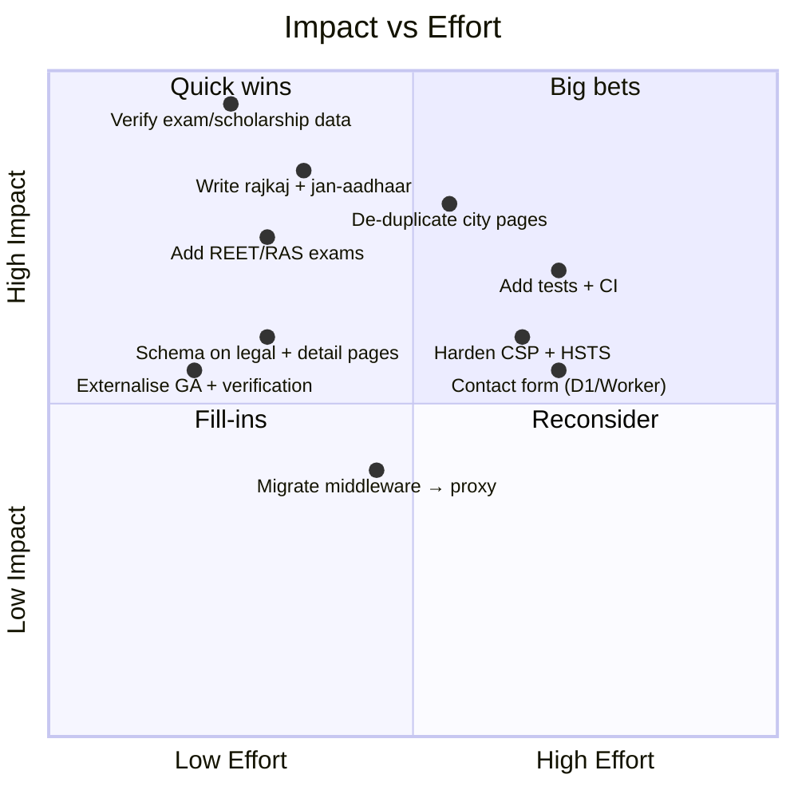

# 12 · Roadmap and Improvements

> [!abstract] A prioritised, code-grounded backlog. Each item notes impact, effort, and the files involved.

## 🎯 Priority matrix

## 🟢 What is solid today

> [!success] Preserve these
> Data-driven architecture · strong SEO scaffolding (per-page metadata, hreflang, JSON-LD `@graph`, sitemap, robots) · fully static + edge-delivered · clear non-affiliation/privacy stance · **home page upgraded to full GEO/E-E-A-T** (see [[13 - Changelog]]).

## 1. Correctness and trust (highest priority)

> [!danger] Do these before promoting the site
> Accuracy is the biggest driver of trust and ranking for a government-information guide.

| # | Recommendation | Files |
|:-:|----------------|-------|
| 1.1 | Verify every exam **fee, last date, exam date** vs official RPSC/RSSB notifications | `data/exams.json`, `lib/examContent.ts` |
| 1.2 | Verify scholarship **eligibility & income limits** | `data/scholarships.json` |
| 1.3 | Keep the **updates feed** current | `data/updates.ts` |
| 1.4 | Add visible **"Last verified"** to exam/service/scholarship pages | data files + templates |
| 1.5 | Create the `contact@rajssoidguide.in` mailbox | infra / `lib/site.ts` |

## 2. Content depth & coverage

| # | Recommendation | Files |
|:-:|----------------|-------|
| 2.1 | Write bespoke **`/service/rajkaj`** + **`/service/jan-aadhaar`** (mirror paymanager) | `data/serviceContent.ts` |
| 2.2 | **De-duplicate the 12 city pages** — per-city facts + a city FAQ, or reduce the set | `data/cities.json`, `lib/pageContent.ts` |
| 2.3 | Add **REET** and **RAS** exams | `data/exams.json`, `lib/examContent.ts` |
| 2.4 | Expand scholarships to template depth + 4–5 FAQs each | `data/scholarships.json` |
| 2.5 | More **error-fix** pages + a Related-links block | `data/errors.json`, `error/[code]` |
| 2.6 | Add **screenshots** to login/registration guides | `public/`, `GuideArticle.tsx` |

## 3. Structured data & SEO

| # | Recommendation | Files |
|:-:|----------------|-------|
| 3.1 | Add **FAQ + Article JSON-LD** to templated detail pages (city/scholarship/service-fallback) | detail `page.tsx` + `schema.ts` |
| 3.2 | Add **WebPage/Article schema** to `/privacy-policy` + `/terms-of-service` | legal `page.tsx` |
| 3.3 | Decide on the **robots AI-scraper block** vs GEO goals (relax if you want Perplexity/ChatGPT citations) | `app/robots.ts` |

## 4. Configuration & maintainability

| # | Recommendation | Files |
|:-:|----------------|-------|
| 4.1 | Move **GA ID** + **Google verification token** to env vars | `app/[locale]/layout.tsx` |
| 4.2 | Migrate `middleware.ts` → **`proxy.ts`** (Next 16 deprecation warning) | `src/middleware.ts` |
| 4.3 | Bump Wrangler **`compatibility_date`** to a recent date | `wrangler.jsonc` |
| 4.4 | Add `lastVerified`/`source` fields to exam/service/scholarship data | `lib/content.ts`, data files |

## 5. Security hardening

| # | Recommendation | Files |
|:-:|----------------|-------|
| 5.1 | Replace CSP `'unsafe-inline'`/`'unsafe-eval'` with **nonces/hashes** | `next.config.ts` |
| 5.2 | Add **`Strict-Transport-Security`** (HSTS) | `next.config.ts` |
| 5.3 | Scope `connect-src` to exact analytics endpoints | `next.config.ts` |

## 6. Quality, testing & CI

> [!note] No automated tests exist today — the project relies on `lint` + `build`.

| # | Recommendation | Tooling |
|:-:|----------------|---------|
| 6.1 | **Data-validation** test (schema check for all data files) | Vitest + zod |
| 6.2 | **Build-in-CI** (lint + `next build --webpack`) on PRs | GitHub Actions |
| 6.3 | Internal-link checker + JSON-LD validator | CI script |
| 6.4 | **Bilingual-parity** guard (every `en` key has a `hi` key) | small script |

## 7. Optional future capability

Deferred (see [[11 - Backend and Database]]): contact / "report incorrect info" form (Worker + D1) · update subscriptions · headless/Git CMS.

## 🗓️ Suggested sequencing

```mermaid
gantt
    title Rough sequencing (relative effort)
    dateFormat X
    axisFormat %s
    section Now
    Verify exam/scholarship data   :a1, 0, 2
    Write rajkaj + jan-aadhaar     :a2, 0, 2
    Externalise GA + verification  :a3, 0, 1
    section Next
    De-duplicate city pages        :b1, 2, 3
    Add REET/RAS + more errors     :b2, 2, 2
    Schema on legal + detail       :b3, 3, 2
    Harden CSP + HSTS              :b4, 3, 2
    section Later
    Tests + CI                     :c1, 5, 3
    middleware → proxy             :c2, 5, 1
    Contact form (Worker + D1)     :c3, 6, 2
```

---

## 🔗 Related

[[05 - Content Inventory]] · [[06 - SEO and Structured Data]] · [[07 - Security and Performance]] · [[11 - Backend and Database]] · [[13 - Changelog]] · [[README]]
