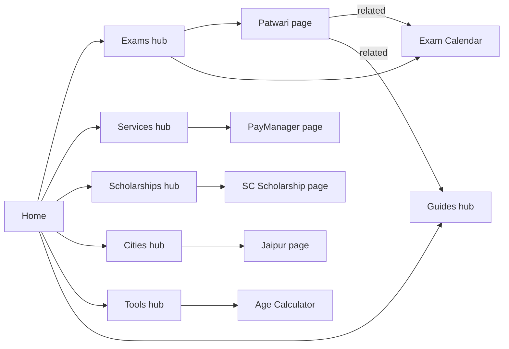

# Page Flow & Site Structure (User View)

This document explains how the RajSSO Guide website is laid out and how a normal
visitor moves through it. It focuses on **pages, URLs, and journeys** — not code.
Written in plain Markdown.

- Live site: `https://rajssoidguide.in`
- Languages: English (`/en`, default) and Hindi (`/hi`)
- Every page exists in both languages.

---

## 1. How the URLs are built

Every address follows the same simple shape:

```
https://rajssoidguide.in / {language} / {section} / {item}
                            \_______/   \________/   \____/
                             en or hi    e.g. exam    e.g. patwari
```

Examples a visitor might see:

| What the user wants | URL they land on |
|---------------------|------------------|
| Home page (English) | `/en` |
| Home page (Hindi) | `/hi` |
| How to log in | `/en/sso-id-login` |
| List of exams | `/en/exams` |
| One specific exam | `/en/exam/patwari` |
| Scholarships list | `/en/scholarships` |
| SSO help for Jaipur | `/en/city/jaipur` |
| Age calculator tool | `/en/tools/age-calculator` |
| Fix "server busy" error | `/en/error/server-busy` |

Two short addresses automatically forward to the correct list page:

- `/en/city` → sends the user to `/en/cities`
- `/en/scholarship` → sends the user to `/en/scholarships`

---

## 2. The full site map (everything a visitor can open)

```
HOME  /en
│
├─ GUIDES  /en/guides
│   ├─ /en/sso-id-login            (How to log in)
│   ├─ /en/sso-id-registration     (How to create an ID)
│   ├─ /en/forgot-sso-id           (Recover a lost ID)
│   └─ /en/merge-sso-id            (Merge duplicate IDs)
│
├─ EXAMS  /en/exams
│   ├─ /en/exam/rpsc-cet
│   ├─ /en/exam/rsmssb-ldc
│   ├─ /en/exam/patwari
│   └─ /en/exam-calendar           (All dates in one table)
│
├─ SERVICES  /en/services
│   ├─ /en/service/paymanager
│   ├─ /en/service/rajkaj
│   └─ /en/service/jan-aadhaar
│
├─ SCHOLARSHIPS  /en/scholarships
│   ├─ /en/scholarship/sc
│   ├─ /en/scholarship/st
│   ├─ /en/scholarship/obc
│   ├─ /en/scholarship/ews
│   └─ /en/scholarship/minority
│
├─ CITIES  /en/cities
│   ├─ /en/city/jaipur      /en/city/jodhpur    /en/city/kota
│   ├─ /en/city/udaipur     /en/city/ajmer      /en/city/bikaner
│   ├─ /en/city/alwar       /en/city/bharatpur  /en/city/sikar
│   └─ /en/city/bhilwara    /en/city/pali       /en/city/sri-ganganagar
│
├─ TOOLS  /en/tools
│   ├─ /en/tools/age-calculator
│   ├─ /en/tools/sso-id-validator
│   ├─ /en/tools/jan-aadhaar-status
│   ├─ /en/tools/otr-fee-calculator
│   ├─ /en/tools/photo-resizer
│   └─ /en/tools/scholarship-calculator
│
├─ UPDATES  /en/updates          (Latest news feed)
├─ SEARCH   /en/search           (Search the whole site)
│
├─ ERROR FIXES
│   ├─ /en/error/captcha-not-loading
│   ├─ /en/error/server-busy
│   └─ /en/error/id-already-exists
│
└─ TRUST & LEGAL
    ├─ /en/about
    ├─ /en/contact
    ├─ /en/privacy-policy
    └─ /en/terms-of-service
```

The same tree exists again under `/hi` for Hindi.

### 2.1 How to read the tables (color key)

Every page is graded on real SEO / AI-search factors, checked page-by-page
against the actual codebase (schema functions in `lib/schema.ts`, content in
`src/data/*` and `src/lib/pageContent.ts`).

**Color = overall SEO health**

- 🟢 **HIGH** — strong unique content + full schema + good links. Leave as-is.
- 🟡 **MEDIUM** — works, but short, templated, or missing schema/FAQ. Improve.
- 🔴 **LOW** — thin or near-duplicate. Fix first.
- ⚪ **N/A** — intentionally not indexed (no SEO goal).

**Columns**

- **Words** = measured English words from the source content files
  (Devanagari/Hindi counted separately; real bilingual total is ~2×). Approximate.
- **Min** = recommended minimum unique English words for that page type to compete
  and be citable by AI answers.
- **Schema** = structured data actually emitted (BC = BreadcrumbList,
  IL = ItemList, FAQ = FAQPage, HT = HowTo, Art = Article, Org = Organization,
  Per = Person, WP = WebPage).
- **FAQ** = does the page render a real FAQ block? ✅ / ❌

### 2.2 SEO quality and content length — page by page

**Home & hub (list) pages**

| Page | Health | Words | Min | Schema | FAQ | What to improve |
|------|:--:|:--:|:--:|--------|:--:|-----------------|
| `/` Home | 🟢 | ~2,500 | 1,500 | WP·4×HT·FAQ·BC | ✅ | Best page on the site. Keep dates/fees fresh. |
| `/guides` | 🟢 | ~900 | 800 | IL·FAQ·BC | ✅ | Fine. |
| `/exams` | 🟢 | ~800 | 800 | IL·FAQ·BC | ✅ | Verify fees/dates; add more exams later. |
| `/services` | 🟢 | ~1,100 | 800 | IL·FAQ·BC | ✅ | Fine. |
| `/scholarships` | 🟢 | ~1,600 | 800 | IL·HT·FAQ·BC | ✅ | Verify income limits. |
| `/cities` | 🟡 | ~350 | 600 | IL·FAQ·BC | ✅ | Add 2–3 paragraphs + more FAQs. |
| `/tools` | 🟢 | ~750 | 500 | IL·FAQ·BC | ✅ | Fine. |
| `/updates` | 🟢 | ~700 | 500 | IL·FAQ·BC | ✅ | Keep feed fresh (freshness = AI citations). |

**Guide pages (core how-to)**

| Page | Health | Words | Min | Schema | FAQ | What to improve |
|------|:--:|:--:|:--:|--------|:--:|-----------------|
| `/sso-id-login` | 🟢 | ~950 | 700 | Art·HT·FAQ·BC | ✅ | Keep "last verified" date current. |
| `/sso-id-registration` | 🟢 | ~950 | 700 | Art·HT·FAQ·BC | ✅ | Good. |
| `/forgot-sso-id` | 🟢 | ~900 | 700 | Art·HT·FAQ·BC | ✅ | Good. |
| `/merge-sso-id` | 🟢 | ~850 | 700 | Art·HT·FAQ·BC | ✅ | Good. |

**Exam pages**

| Page | Health | Words | Min | Schema | FAQ | What to improve |
|------|:--:|:--:|:--:|--------|:--:|-----------------|
| `/exam/rpsc-cet` | 🟡 | ~280 | 600 | BC only | ❌ | Good content but short — add FAQ + Article schema + more depth. |
| `/exam/rsmssb-ldc` | 🟡 | ~280 | 600 | BC only | ❌ | Same; verify dates. |
| `/exam/patwari` | 🟡 | ~280 | 600 | BC only | ❌ | Same. |
| `/exam-calendar` | 🟡 | ~120 | 400 | IL·BC | ❌ | Add an intro + short FAQ around the table. |

**Service pages**

| Page | Health | Words | Min | Schema | FAQ | What to improve |
|------|:--:|:--:|:--:|--------|:--:|-----------------|
| `/service/paymanager` | 🟢 | ~1,700 | 700 | HT·FAQ·BC | ✅ | Model page. Nothing needed. |
| `/service/rajkaj` | 🔴 | ~200 | 700 | BC only | ❌ | **Biggest gap.** Write rich content like PayManager. |
| `/service/jan-aadhaar` | 🔴 | ~200 | 700 | BC only | ❌ | **Biggest gap.** Same. |

**Scholarship pages (templated)**

| Page | Health | Words | Min | Schema | FAQ | What to improve |
|------|:--:|:--:|:--:|--------|:--:|-----------------|
| `/scholarship/sc` | 🟡 | ~200 | 500 | BC only | ❌ | Add amount, dates, exact documents; add FAQ + schema. |
| `/scholarship/st` | 🟡 | ~200 | 500 | BC only | ❌ | Same. |
| `/scholarship/obc` | 🟡 | ~200 | 500 | BC only | ❌ | Same. |
| `/scholarship/ews` | 🟡 | ~200 | 500 | BC only | ❌ | Same. |
| `/scholarship/minority` | 🟡 | ~200 | 500 | BC only | ❌ | Same. |

**City pages (templated — highest duplicate-content risk)**

| Page | Health | Words | Min | Schema | FAQ | What to improve |
|------|:--:|:--:|:--:|--------|:--:|-----------------|
| `/city/jaipur` … `/city/sri-ganganagar` (12) | 🔴 | ~200 each | 500 | BC only | ❌ | All 12 share one template with words swapped. Add unique local facts (e-Mitra count, key offices, colleges) + a per-city FAQ, or reduce the set. |

**Tool pages**

| Page | Health | Words | Min | Schema | FAQ | What to improve |
|------|:--:|:--:|:--:|--------|:--:|-----------------|
| `/tools/age-calculator` | 🟡 | ~200 | 400 | BC only | ❌ | Add FAQ + HowTo/SoftwareApplication schema. |
| `/tools/sso-id-validator` | 🟡 | ~190 | 400 | BC only | ❌ | Same. |
| `/tools/jan-aadhaar-status` | 🟡 | ~190 | 400 | BC only | ❌ | Same. |
| `/tools/otr-fee-calculator` | 🟡 | ~200 | 400 | BC only | ❌ | Same. |
| `/tools/photo-resizer` | 🟡 | ~190 | 400 | BC only | ❌ | Same. |
| `/tools/scholarship-calculator` | 🟡 | ~190 | 400 | BC only | ❌ | Same. |

**Error-fix pages**

| Page | Health | Words | Min | Schema | FAQ | What to improve |
|------|:--:|:--:|:--:|--------|:--:|-----------------|
| `/error/captcha-not-loading` | 🔴 | ~110 | 400 | HT·BC | ❌ | Add "why it happens" + prevention + related links + FAQ. |
| `/error/server-busy` | 🔴 | ~110 | 400 | HT·BC | ❌ | Same. |
| `/error/id-already-exists` | 🔴 | ~110 | 400 | HT·BC | ❌ | Same. |

**Trust, legal & utility**

| Page | Health | Words | Min | Schema | FAQ | What to improve |
|------|:--:|:--:|:--:|--------|:--:|-----------------|
| `/about` | 🟢 | ~450 | 400 | Org·Per·BC | ❌ | Strong E-E-A-T. Fine. |
| `/contact` | 🟢 | ~300 | 250 | Org·BC | ❌ | Fine. |
| `/privacy-policy` | 🟡 | ~800 | — | none | ❌ | Add WebPage/Article schema. |
| `/terms-of-service` | 🟡 | ~900 | — | none | ❌ | Add WebPage/Article schema. |
| `/search` | ⚪ | ~30 | — | none | ❌ | Correctly noindex. No action. |

### 2.3 What the codebase analysis found (summary)

Counts pulled directly from the source, not guessed:

- **Content is stored in data files:** `src/data/*.json`, `src/data/*.ts`, and the
  shared templates in `src/lib/pageContent.ts`.
- **Data volume:** 4 guides, 3 exams, 3 services, 5 scholarships, 12 cities,
  6 tools, 3 error fixes.
- **Bespoke (unique) vs templated content:**
  - Bespoke, hand-written: Home, all 6 hubs, 4 guides, `paymanager`, 3 exam
    details, all hub editorials, scholarships hub. → these are the 🟢 pages.
  - Templated (shared 3-paragraph generator in `pageContent.ts`): 12 city pages,
    5 scholarship details, and `rajkaj` + `jan-aadhaar`. → these are the 🟡/🔴 pages.
- **FAQ block present on:** Home, all hubs (guides, exams, services, scholarships,
  cities, tools, updates), 4 guides, `paymanager`. **Missing on:** every exam,
  scholarship, city, tool, and error detail page.
- **Schema coverage:** every content page has BreadcrumbList; hubs add ItemList +
  FAQPage; guides add Article + HowTo + FAQPage; Home is richest (WebPage + 4 HowTo
  + FAQPage). **Detail pages with only BreadcrumbList** (schema gap): exams,
  scholarships, cities, tools. **Legal pages have no schema at all.**
- **Biggest single weakness:** `rajkaj` and `jan-aadhaar` fall back to the generic
  template while their sibling `paymanager` is fully built out (~1,700 words).

### 2.4 Fix order (highest impact first)

1. 🔴 **Write full content for `/service/rajkaj` and `/service/jan-aadhaar`** —
   mirror PayManager (intro, steps, tables, FAQ). ~200 → ~800 words each.
2. 🔴 **De-duplicate the 12 city pages** — add unique local facts + a per-city FAQ.
3. 🔴 **Expand the 3 error pages** — causes, prevention, related links, FAQ.
4. 🟡 **Add FAQ + schema to exam, scholarship, and tool detail pages** — biggest
   AI-citation win, since these are all schema-thin today.
5. 🟡 **Add schema to legal pages**; add a short intro + FAQ to `/exam-calendar`.
6. 🟡 **Grow `/cities` hub** slightly and keep all dates/fees verified.

### 2.5 Minimum content targets by page type (quick reference)

| Page type | Minimum unique words (per language) |
|-----------|:--:|
| Home | 1,500 |
| Hub / list pages | 800 |
| How-to guide | 700 |
| Service / exam detail | 600–700 |
| Scholarship / city detail | 500 |
| Tool page (supporting text) | 400 |
| Error-fix page | 400 |
| Exam calendar (utility) | 400 |
| About / Contact | 250–400 |

---

## 3. What the visitor sees in the menus

**Top header (on every page):**

- Direct links: **Updates** (with a "New" dot) and **Calendar**
- Dropdown menus:
  - **Guides** → Login, Registration, Forgot ID, Merge ID
  - **Exams** → Exams list, Exam Calendar, individual exams
  - **Services** → Services list, PayManager, RajKaj, Jan Aadhaar
  - **Tools** → all 6 tools
  - **Help** → About, Contact, Cities, Sitemap, Privacy, Terms
- A **search icon** and a **language switch (EN / हिं)**

**Footer (on every page):**

- Link columns: Guides · Explore · Help & Info
- Contact row: email, WhatsApp, official portal link
- Social links and the author credit

**On every content page:** a **breadcrumb trail** at the top, e.g.
`Home → Exams → Rajasthan Patwari`, so users always know where they are and can
step back one level.

---

## 4. How the pages connect (hub-and-spoke)

The site is built around **hub pages** (big list pages) and **spoke pages**
(single-topic pages). A visitor usually lands on a hub, picks an item, reads the
detail, then jumps to a related page.



Detail pages always offer a way forward: **"Important Links"** (official portals)
and **"Related"** links (nearby topics), so the visitor rarely hits a dead end.

---

## 5. URL flow examples (what the address bar does)

**A. New user creating an SSO ID**
```
/en  →  /en/guides  →  /en/sso-id-registration  →  (official portal opens in new tab)
```

**B. Someone who forgot their ID**
```
/en  →  quick-access box  →  /en/forgot-sso-id  →  follow steps / send SMS "RJ SSO"
```

**C. Job seeker checking an exam**
```
/en  →  /en/exams  →  /en/exam/patwari  →  /en/exam-calendar  (check deadline countdown)
```

**D. Student checking a scholarship**
```
/en  →  /en/scholarships  →  /en/scholarship/sc  →  official SJE portal
```

**E. Local help**
```
/en  →  /en/cities  →  /en/city/jaipur  →  /en/sso-id-login
```

**F. Using a tool**
```
/en  →  /en/tools  →  /en/tools/age-calculator  (runs in the browser, no login)
```

**G. Fixing an error (often arrives straight from Google)**
```
Google "sso server busy fix"  →  /en/error/server-busy  →  follow fix steps
```

---

## 6. Detailed visitor journeys

### Journey 1 — "I need to make an SSO ID"
1. Lands on **Home** (`/en`).
2. Reads the "What is SSO ID" section and the registration steps.
3. Clicks **Registration** → **`/en/sso-id-registration`**.
4. Reads the step-by-step guide, documents needed, and FAQ.
5. Uses **Important Links** to open the official portal and finish there.

### Journey 2 — "I forgot my SSO ID / can't log in"
1. Home → **quick-access** grid or **Guides** menu.
2. Opens **`/en/forgot-sso-id`**.
3. Follows recovery steps, including the SMS method (`RJ SSO` to the listed number).
4. If they see an error message, a link sends them to the matching
   **`/en/error/...`** page.

### Journey 3 — "When is the exam and what's the fee?"
1. Home → **Exams** menu → **`/en/exams`**.
2. Scans exam cards (each shows OTR fee + last date).
3. Opens a specific exam, e.g. **`/en/exam/rpsc-cet`**, for full detail.
4. Jumps to **`/en/exam-calendar`** to see a live countdown to the deadline.

### Journey 4 — "Which scholarship am I eligible for?"
1. Home → **`/en/scholarships`**.
2. Picks a category card → **`/en/scholarship/obc`**.
3. Reads eligibility + how to apply via SSO.
4. Optionally opens **`/en/tools/scholarship-calculator`** to check income limits.

### Journey 5 — "I need help in my city"
1. Home → **Help** menu → **`/en/cities`**.
2. Selects a city → **`/en/city/udaipur`**.
3. Reads local e-Mitra guidance, then clicks Login or Registration.

### Journey 6 — "Quick tool, no account needed"
1. Home → **Tools** menu → **`/en/tools`**.
2. Opens a tool, e.g. **`/en/tools/photo-resizer`**.
3. Uses it instantly in the browser — nothing is uploaded or stored.

### Journey 7 — "What changed recently?"
1. Home shows the latest updates preview.
2. Clicks "View all" → **`/en/updates`** for the full dated feed.

---

## 7. What each page does for the visitor

| Page | What the visitor gets |
|------|-----------------------|
| **Home** | Overview of SSO, quick actions, login/registration steps, fees, latest updates, FAQ |
| **Guides hub** | A menu of the 4 core how-to guides + which one to pick |
| **Login / Registration / Forgot / Merge** | Full step-by-step instructions with FAQ |
| **Exams hub** | All exams with fee and last date at a glance |
| **Exam detail** | Deep detail on one exam: fees, eligibility, process |
| **Exam Calendar** | One table of all deadlines with a live "days left" countdown |
| **Services hub** | What 100+ SSO services are and how to reach them |
| **Service detail** | How to use one service (e.g. PayManager salary slip) |
| **Scholarships hub** | All scholarship categories and how to apply |
| **Scholarship detail** | Eligibility + application steps for one category |
| **Cities hub / city page** | Local SSO and e-Mitra help for a district |
| **Tools hub / tool** | Free calculators and checkers that run in the browser |
| **Updates** | Latest SSO/exam news feed |
| **Search** | Instant search across every page |
| **Error pages** | Fix for a specific SSO error message |
| **About / Contact** | Who runs the site, how to reach them, how content is verified |
| **Privacy / Terms** | Legal and privacy information |

---

## 8. Switching language

A language switch (EN / हिं) sits in the header on every page. Choosing it keeps
the visitor on the **same page** in the other language — for example
`/en/exam/patwari` becomes `/hi/exam/patwari`. Search engines are told these two
pages are translations of each other, so the correct language is shown to the
right audience.

---

## 9. How visitors arrive

- **Google search** — often straight to a deep page (an exam, a city, or an error
  fix), not always the home page.
- **Direct / shared links** — WhatsApp shares are built into guides and updates.
- **Inside the site** — menus, breadcrumbs, "Related" links, and "Important Links"
  keep people moving between connected topics.

Because of the breadcrumb trail and related-links on every page, a visitor who
lands deep in the site can always climb back up to the relevant hub or the home
page.
