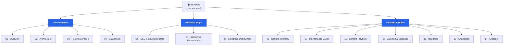

# 🏠 RajSSO Guide — Documentation Home

> [!abstract] What this vault is
> The **complete, code-verified** documentation for [**rajssoidguide.in**](https://rajssoidguide.in) — an independent, bilingual (English + Hindi) informational guide to the Rajasthan **SSO ID** portal.
>
> This folder is a self-contained **Obsidian vault**. Notes are linked with `[[wikilinks]]`, illustrated with `mermaid` diagrams, and annotated with `> [!callout]` blocks. Everything also renders as plain Markdown on GitHub.

> [!tip]- How to get the best experience in Obsidian (click to expand)
> 1. **Open the `docs/` folder as a vault** (Open folder as vault).
> 2. Press the **Graph View** icon in the left ribbon to see how every note connects.
> 3. **Hover** any `[[link]]` for a live preview; `Ctrl/Cmd+Click` to open in a split.
> 4. Open the **Outline** pane for in-note navigation.
> 5. Use **Search** (`Ctrl/Cmd+Shift+F`) with the `tag:` filters listed below.
> 6. Mermaid diagrams and callouts render automatically — no plugins required.

---

## 🗺️ Vault map

---

## 📚 Contents

| # | Note | Purpose | Tags |
|:-:|------|---------|------|
| — | [[README]] | This dashboard | `#moc` |
| 01 | [[01 - Overview]] | What the project is, principles, stack, key facts | `#overview` |
| 02 | [[02 - Architecture]] | Request lifecycle, middleware, config, folders, i18n | `#architecture` |
| 03 | [[03 - Routing and Pages]] | Full site map, page types, navigation, journeys | `#pages` |
| 04 | [[04 - Data Model]] | Every data source, TypeScript shapes, content libs | `#data` |
| 05 | [[05 - Content Inventory]] | Per-page content depth + review scores | `#content` |
| 06 | [[06 - SEO and Structured Data]] | Metadata, JSON-LD `@graph`, hreflang, GEO | `#seo` |
| 07 | [[07 - Security and Performance]] | Headers, CSP, perf, accessibility | `#security` |
| 08 | [[08 - Cloudflare Deployment]] | OpenNext build/deploy, Wrangler, troubleshooting | `#deployment` |
| 09 | [[09 - Maintenance Guide]] | How to add/update content safely | `#maintenance` |
| 10 | [[10 - Content Playbook]] | Templates, checklists, and the AI content prompt | `#workflow` |
| 11 | [[11 - Backend and Database]] | If/when to add a backend — options & tradeoffs | `#planning` |
| 12 | [[12 - Roadmap and Improvements]] | Prioritised, code-grounded backlog | `#roadmap` |
| 13 | [[13 - Changelog]] | Record of the June 2026 SEO/GEO upgrades | `#changelog` |
| 14 | [[14 - Glossary]] | SSO + project terminology | `#glossary` |
| 15 | [[15 - Page Flow and Low-Level Detail]] | Visitor's view: URL structure, site map, and user journeys | `#pages` |
| 16 | [[16 - 30-Day SEO and Authority Roadmap]] | Day-by-day plan: DR 0→10, long-tail rankings, AI citations | `#seo` `#growth` |
| 17 | [[17 - Directory Submissions and Listing Assets]] | Per-platform, SEO-optimised listing copy + backlink tracker | `#seo` `#link-building` |

---

## 🧭 Recommended reading paths

> [!example]- New developer onboarding
> [[01 - Overview]] → [[03 - Routing and Pages]] → [[02 - Architecture]] → [[04 - Data Model]] → [[09 - Maintenance Guide]] → [[08 - Cloudflare Deployment]]

> [!example]- Content editor / SEO
> [[05 - Content Inventory]] → [[06 - SEO and Structured Data]] → [[10 - Content Playbook]] → [[12 - Roadmap and Improvements]]

> [!example]- Grow traffic & authority (30-day sprint)
> [[16 - 30-Day SEO and Authority Roadmap]] → [[17 - Directory Submissions and Listing Assets]] → [[06 - SEO and Structured Data]] → [[10 - Content Playbook]]

> [!example]- Ship it today
> [[08 - Cloudflare Deployment]] → [[07 - Security and Performance]] → [[13 - Changelog]]

---

## ✅ Status at a glance

> [!success] Verified against the codebase on **27 June 2026**
> Every fact below was re-checked against the actual source on the `cloudflare` branch.

| Fact | Value |
|------|-------|
| **Stack** | Next.js `16.2.7` · React `19.2.4` · TypeScript `5` · Tailwind CSS `4` |
| **Rendering** | Static Site Generation (SSG) — no app backend / database |
| **Hosting** | Cloudflare Workers via OpenNext (`@opennextjs/cloudflare`) |
| **Worker name** | `rajssoguide` → `rajssoguide.devxkamlesh.workers.dev` |
| **Custom domain** | `rajssoidguide.in` |
| **Locales** | `/en` (default) + `/hi`, `x-default → /en` |
| **Pages** | ~122 static routes (~61 per language) |
| **Middleware** | `src/middleware.ts` sets `x-locale`; prefixing via `next.config.ts` `redirects()` |
| **Analytics** | Google Analytics `G-RYT943398Y` (lazy-loaded) |
| **Data** | 3 exams · 3 services · 5 scholarships · 12 cities · 6 guides · 6 tools · 6 errors |

> [!warning] Ongoing accuracy duty
> Exam dates/fees, scholarship income limits, and the updates feed are **realistic values that must be re-verified** against official notifications. See [[12 - Roadmap and Improvements#1. Correctness and trust]].

---

## 🔖 Tag directory

`#overview` `#architecture` `#pages` `#data` `#content` `#seo` `#security` `#deployment` `#maintenance` `#workflow` `#planning` `#roadmap` `#changelog` `#glossary`

%% Maintainers: keep the Status table and 13 - Changelog in sync after every deploy. %%
