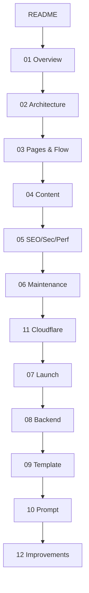

# RajSSO Guide — Documentation

This folder is the complete, code-verified documentation for **rajssoidguide.in**, an independent bilingual (English/Hindi) informational guide for the Rajasthan SSO ID portal.

It is an **Obsidian vault**. Notes use `[[wiki links]]` for clickable navigation, backlinks, and a graph view, plus `mermaid` diagrams and `> [!callout]` blocks for visual data. Everything also reads correctly as plain Markdown on GitHub.

> [!info] How to read this vault in Obsidian
> Open the `docs/` folder as a vault. Use the **graph view** (left ribbon) to see how notes connect, hover any `[[link]]` for a preview, and open the **outline** for in-note navigation. Diagrams render automatically.

## Map of contents

## Contents

| Document | Purpose |
|----------|---------|
| [[01 - Overview]] | What the project is, the technology used, and key facts |
| [[02 - Architecture]] | Code structure, data flow, routing, and how pages are generated |
| [[03 - Pages and Flow]] | Full site map, every page type, navigation, and user journeys |
| [[04 - Content Inventory]] | Per-page content breakdown, word counts, and review scores |
| [[05 - SEO Security Performance]] | SEO system, structured data, security headers, performance |
| [[06 - Maintenance Guide]] | How to add or update content without breaking anything |
| [[07 - Launch Review]] | Pre-launch checklist and readiness scorecard |
| [[08 - Backend and Database]] | Analysis of adding a backend/database, with pros and cons |
| [[09 - Content Template and Checklist]] | Reusable template and checklists for creating new content |
| [[10 - Content Prompt Template]] | Ready-to-paste prompt for requesting a new page |
| [[11 - Cloudflare Deployment]] | Cloudflare Workers (OpenNext) build/deploy settings and troubleshooting |
| [[12 - Improvements and Recommendations]] | Prioritised backlog of technical and content improvements |

## Recommended reading order

1. [[01 - Overview]] — understand the project at a high level
2. [[03 - Pages and Flow]] — see how the site is organised
3. [[02 - Architecture]] — learn how it works in code
4. [[04 - Content Inventory]] — review the actual content
5. [[06 - Maintenance Guide]] — learn to extend it
6. [[11 - Cloudflare Deployment]] — learn how it ships
7. [[07 - Launch Review]] — confirm it is ready
8. [[12 - Improvements and Recommendations]] — plan what is next

## Status at a glance

> [!success] Verified against the codebase on 17 June 2026
> The facts below were re-checked against the actual source on this branch.

- **Stack:** Next.js 16.2.7, React 19.2.4, TypeScript 5, Tailwind CSS 4.
- **This branch (`cloudflare`):** deployed to **Cloudflare Workers** via the OpenNext adapter (`@opennextjs/cloudflare`). A separate `main` branch targets Vercel — see [[11 - Cloudflare Deployment]] and `DEPLOYMENT-BRANCHES.md`.
- **Rendering:** fully static / pre-rendered (SSG). No application backend or database.
- **Analytics:** Google Analytics (`G-RYT943398Y`), loaded lazily in the locale layout.
- **Locale routing:** handled by `next.config.ts` `redirects()` — there is **no** `proxy.ts` middleware on this branch.
- **Pages:** ~100 static pages (~50 per language).
- **Launch state:** ready, pending verification of dates and fees in the data files.
